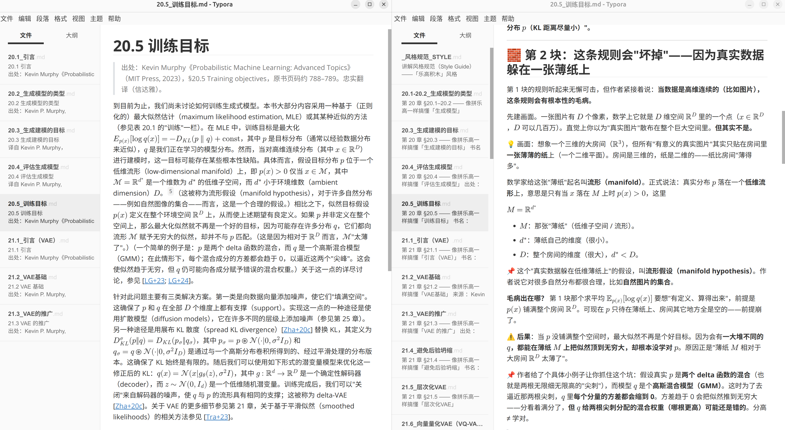

# PML Advanced Topics —— 中文双版本

本仓库是 Kevin P. Murphy **《Probabilistic Machine Learning: Advanced Topics》** (MIT Press, 2023) 的中文整理，并提供两种翻译风格，适合对 AI 感兴趣者、入门研究人员参考。

- **原著**：Kevin P. Murphy, *Probabilistic Machine Learning: Advanced Topics*, MIT Press, 2023.
- 原书主页与 PDF：<https://probml.github.io/pml-book/book2.html>

两个翻译风格如下图所示：

| 文件夹                           | 风格                                                         | 适合                     |
| -------------------------------- | ------------------------------------------------------------ | ------------------------ |
| [`类比助理解版/`](类比助理解版/) | **乐高积木式重写讲解**——零术语起步、打比方、补直觉、一块块拼出全貌（公式 1:1、知识点 100% 不丢） | 想真正"看懂"概念         |
| [`信达雅翻译版/`](信达雅翻译版/) | **忠实翻译**——恪守严复「信达雅」，原文结构/表格/图/公式/脚注原封不动按原位保留，不增删发挥 | 想读"作者用中文写的原文" |

## 阅读建议

- 含 LaTeX 公式，建议用支持数学渲染的阅读器：**Typora （作者推荐 Typora）/ Obsidian / VS Code(Markdown+Math)**。
- 开启左右分屏，对比阅读**原文翻译**和**类比助记版**。以原文的阅读为主，如果对一些公式、理念不好理解，就用类比助记版的辅助理解。
- 有几个阅读方法：
  - 如果你正在做研究，选择本书中最相关的几个章节来阅读；如果仅仅是感兴趣而学习，从第一章开始即可
  - 一般看一两遍是不够的，一定要反复揣摩，还是不理解的就求助 AI 
  - 仅仅看懂了过一段时间也会忘记，可以让自己做一些输出的工作，也用生动形象的方式，把你理解的算法说出来，例如组建一个学习小组，分享给其他人，如果你能让别的小白理解这个算法，说明你真正融会贯通了

## 风格规范

- 乐高讲解风格：[`类比助理解版/_风格规范_STYLE.md`](类比助理解版/_风格规范_STYLE.md)
- 信达雅翻译风格：见 Claude 技能 `accurate-translator`（忠实原文、通顺明白、选词得体；表格图片原封不动）。

## 版权

- 原书采用 **CC-BY-NC-ND 4.0** 许可。本仓库为学习用途的中文笔记，**不包含原书 PDF 全文**，所有权利归原作者所有。

