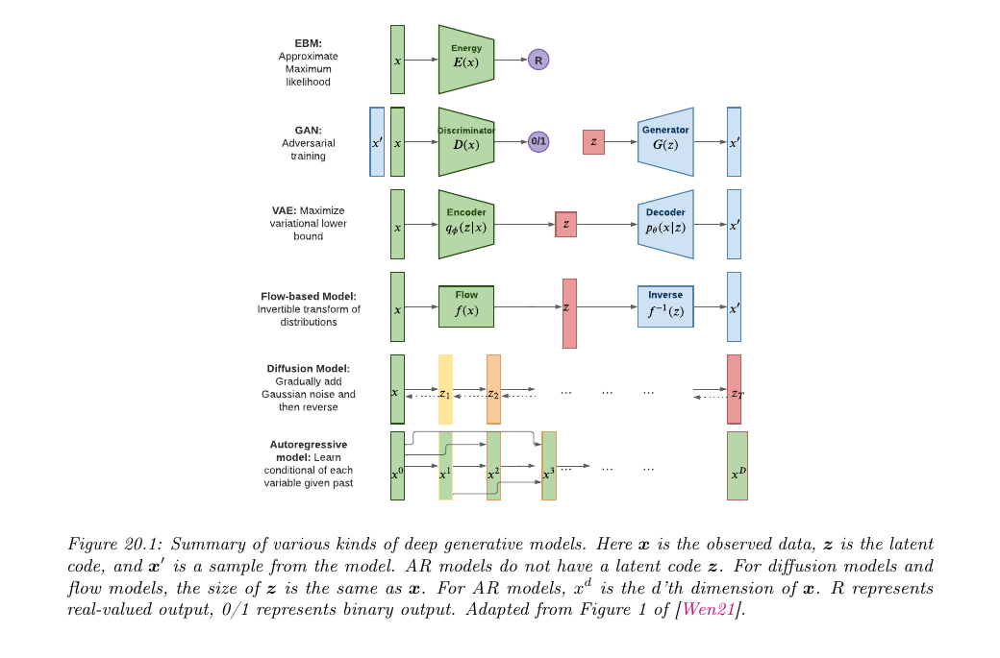

# 20.2 生成模型的类型

> 出处：Kevin P. Murphy,《Probabilistic Machine Learning: Advanced Topics》(MIT Press, 2023)，§20.2 Types of generative model，原书约第 773–775 页。本文为忠实翻译（信达雅）。

生成模型有许多种类，我们在表 20.1 中列出了其中一部分。从高层次看，我们可以区分两大类：一类是**深度生成模型**（deep generative models, DGM）——它们使用深度神经网络来学习从单个潜向量 $z$ 到观测数据 $x$ 的复杂映射；另一类是更为“经典”的**概率图模型**（probabilistic graphical models, PGM），它们使用更简单的、往往是线性的映射，将一组相互关联的潜变量 $z_1, \dots, z_L$ 映射到观测变量 $x_1, \dots, x_D$。当然，二者之间也可能存在许多混合形式。例如，PGM 可以使用神经网络，而 DGM 也可以使用结构化的状态空间。我们在第 4 章中以一般性的方式讨论 PGM，并在第 28 章、第 29 章、第 30 章中给出实例。在本书这一部分，我们主要聚焦于 DGM。

DGM 的主要种类有：**变分自编码器**（variational autoencoders, VAE）、**自回归模型**（autoregressive models, ARM）、**标准化流**（normalizing flows）、**扩散模型**（diffusion models）、**基于能量的模型**（energy based models, EBM），以及**生成对抗网络**（generative adversarial networks, GAN）。我们可以依据以下若干准则对这些模型进行分类（见图 20.1 的可视化概览）：

- **密度（Density）**：模型是否支持对概率密度函数 $p(x)$ 进行逐点求值？若支持，这一求值是快还是慢、是精确的、近似的还是只给出一个界，等等？对于隐式模型（如 GAN），并不存在良定义的密度 $p(x)$。对于另一些模型，我们只能计算密度的一个下界（VAE），或者密度的一个近似（EBM、UPGM）。

- **采样（Sampling）**：模型是否支持生成新样本 $x \sim p(x)$？若支持，这一过程是快还是慢、是精确的还是近似的？有向 PGM、VAE 和 GAN 都支持快速采样。然而，无向 PGM、EBM、ARM、扩散模型和流模型的采样都很慢。

- **训练（Training）**：用何种方法进行参数估计？对于某些模型（如自回归模型、流模型和有向 PGM），我们可以执行精确的**极大似然估计**（maximum likelihood estimation, MLE），尽管其目标函数通常是非凸的，因此我们只能达到局部最优。对于另一些模型，我们无法以可处理的方式计算似然。在 VAE 的情形中，我们最大化似然的一个下界；在 EBM 和 UGM 的情形中，我们最大化似然的一个近似。对于 GAN，我们必须使用极小极大（min-max）训练，这可能不稳定，而且没有清晰的目标函数可供监控。

- **潜变量（Latents）**：模型是否使用潜向量 $z$ 来生成 $x$？若使用，它与 $x$ 同维，还是一种可能经过压缩的表示？例如，ARM 不使用潜变量；流模型和扩散模型使用潜变量，但这些潜变量并未经过压缩。[^1] 图模型（包括 EBM）则可能使用、也可能不使用潜变量。

- **架构（Architecture）**：我们应当使用何种神经网络，是否存在限制？对于流模型，我们被限制为只能使用可逆神经网络，且其每一层都具有可处理的雅可比矩阵。对于 EBM，我们可以使用任何想用的模型。其他模型则各有不同的限制。

| 模型（Model） | 章节（Chapter） | 密度（Density） | 采样（Sampling） | 训练（Training） | 潜变量（Latents） | 架构（Architecture） |
|---|---|---|---|---|---|---|
| PGM-D | 第 4.2 节 | 精确、快（Exact, fast） | 快（Fast） | MLE | 可选（Optional） | 稀疏有向无环图（Sparse DAG） |
| PGM-U | 第 4.3 节 | 近似、慢（Approx, slow） | 慢（Slow） | MLE-A | 可选（Optional） | 稀疏图（Sparse graph） |
| VAE | 第 21 章 | 下界、快（LB, fast） | 快（Fast） | MLE-LB | RL | 编码器-解码器（Encoder-Decoder） |
| ARM | 第 22 章 | 精确、快（Exact, fast） | 慢（Slow） | MLE | 无（None） | 序列式（Sequential） |
| Flows | 第 23 章 | 精确、慢/快（Exact, slow/fast） | 慢（Slow） | MLE | RD | 可逆（Invertible） |
| EBM | 第 24 章 | 近似、慢（Approx, slow） | 慢（Slow） | MLE-A | 可选（Optional） | 判别式（Discriminative） |
| Diffusion | 第 25 章 | 下界（LB） | 慢（Slow） | MLE-LB | RD | 编码器-解码器（Encoder-Decoder） |
| GAN | 第 26 章 | 不可用（NA） | 快（Fast） | 极小极大（Min-max） | RL | 生成器-判别器（Generator-Discriminator） |

**表 20.1**：常见各类生成模型的特性。这里 $D$ 是观测数据 $x$ 的维数，$L$ 是潜向量 $z$（若存在）的维数。（我们通常假设 $L \ll D$，尽管过完备表示可以有 $L \gg D$。）缩写：Approx = 近似（approximate），ARM = 自回归模型（autoregressive model），EBM = 基于能量的模型（energy based model），GAN = 生成对抗网络（generative adversarial network），MLE = 极大似然估计（maximum likelihood estimation），MLE-A = MLE（近似）（MLE approximate），MLE-LB = MLE（下界）（MLE lower bound），NA = 不可用（not available），PGM = 概率图模型（probabilistic graphical model），PGM-D = 有向 PGM（directed PGM），PGM-U = 无向 PGM（undirected PGM），VAE = 变分自编码器（variational autoencoder）。

**图 20.1**：各类深度生成模型概览。这里 $x$ 是观测数据，$z$ 是潜编码（latent code），$x'$ 是来自模型的一个样本。AR 模型没有潜编码 $z$。对于扩散模型和流模型，$z$ 的大小与 $x$ 相同。对于 AR 模型，$x^d$ 是 $x$ 的第 $d$ 维。R 表示实值输出，0/1 表示二值输出。改编自 [Wen21] 的图 1。

[^1]: 流模型定义了一个与 $x$ 同维的潜向量 $z$，尽管其内部的确定性计算可能使用比输入更大或更小的向量（参见例如 DenseFlow 论文 [GGS21]）。
