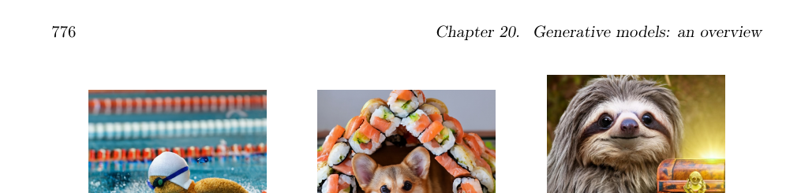
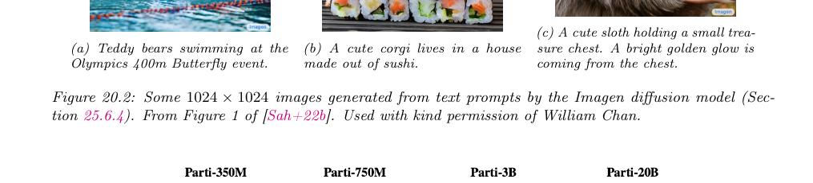
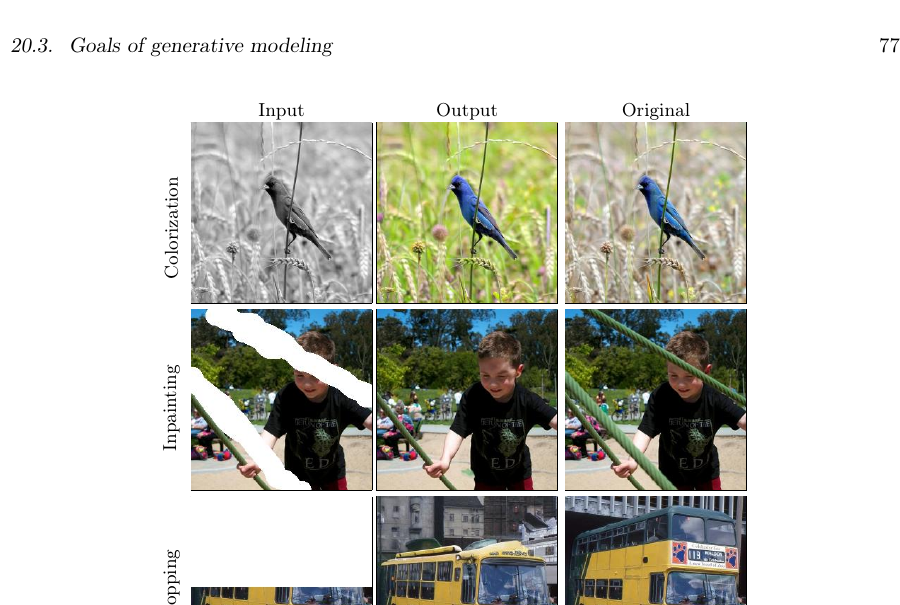
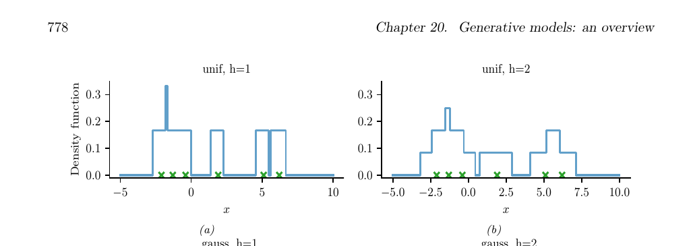
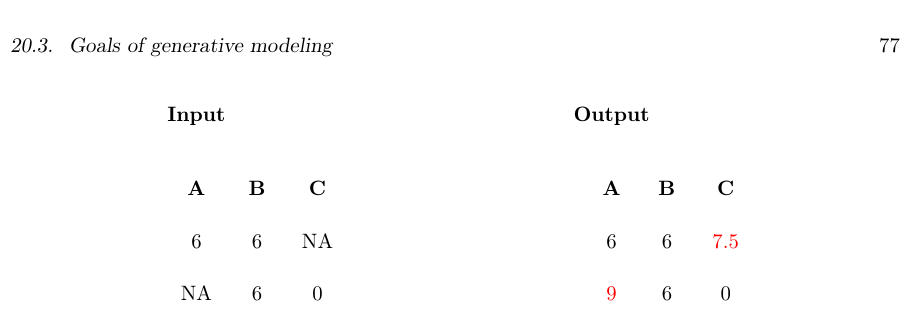
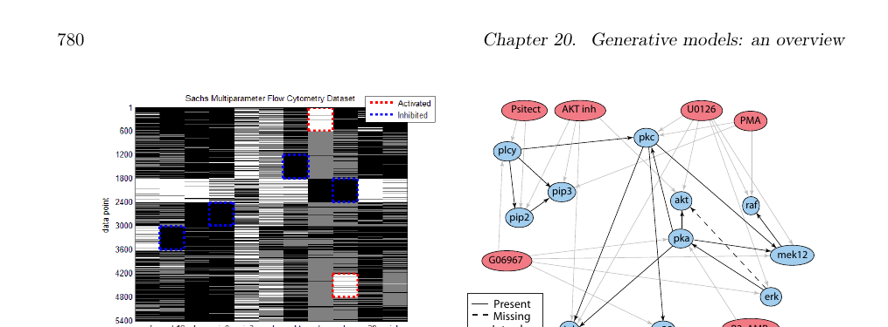
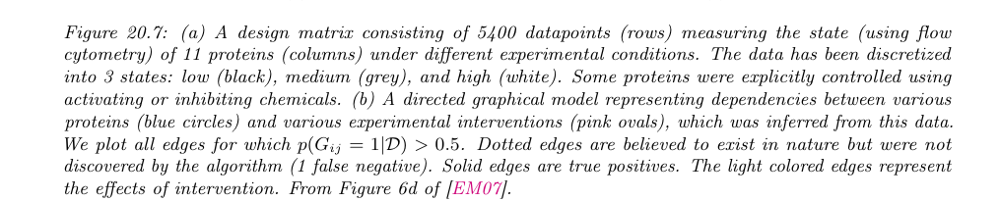
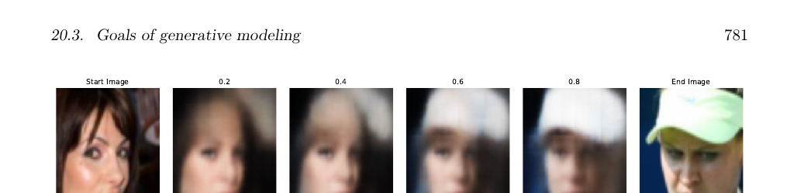
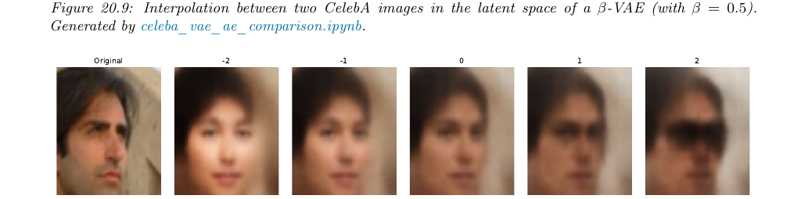

# 20.3 生成建模的目标

> 译自 Kevin P. Murphy，《Probabilistic Machine Learning: Advanced Topics》（MIT Press, 2023），§20.3 "Goals of generative modeling"（含 20.3.1–20.3.10），原书约第 775–782 页。忠实翻译（信达雅）。

生成模型可用于多种不同类型的任务，下文将分别讨论。

## 20.3.1 生成数据（Generating data）

生成模型的主要目标之一是生成（创造）新的数据样本。这有时被称为生成式人工智能（generative AI）（近期综述可参见如 [GBGM23]）。例如，若我们将一个模型 $p(x)$ 拟合到人脸图像上，便可从中采样出新的人脸，如图 25.10 所示。² 类似的方法也可用于创造文本、音频等样本。当这一技术被滥用以制造虚假内容时，它们被称为深度伪造（deep fakes）（参见如 [Ngu+19]）。生成模型还可用于创造合成数据，以训练判别式模型（参见如 [Wil+20; Jor+22]）。

为了控制所生成的内容，使用形如 $p(x|c)$ 的条件生成模型（conditional generative model）会很有用。以下是一些例子：

- $c$ = 文本提示，$x$ = 图像。这是文本到图像模型（text-to-image model）（示例见图 20.2、图 20.3 和图 22.6）。
- $c$ = 图像，$x$ = 文本。这是图像到文本模型（image-to-text model），可用于图像描述（image captioning）。
- $c$ = 图像，$x$ = 图像。这是图像到图像模型（image-to-image model），可用于图像着色、图像修补（inpainting）、外扩补全（uncropping）、JPEG 伪影修复等。示例见图 20.4。
- $c$ = 声音序列，$x$ = 词序列。这是语音到文本模型（speech-to-text model），可用于自动语音识别（automatic speech recognition，ASR）。
- $c$ = 英文词序列，$x$ = 法文词序列。这是序列到序列模型（sequence-to-sequence model），可用于机器翻译（machine translation）。

**图 20.2**：由 Imagen 扩散模型（第 25.6.4 节）根据文本提示生成的一些 1024 × 1024 图像。(a) 在奥运会 400 米蝶泳项目中游泳的泰迪熊。(b) 一只可爱的柯基犬住在用寿司搭成的房子里。(c) 一只可爱的树懒抱着一个小宝箱。一道明亮的金光从箱中透出。取自 [Sah+22b] 的图 1。蒙 William Chan 惠允使用。

**图 20.3**：Parti transformer 模型（第 22.4.2 节）根据文本提示生成的一些图像。我们展示了规模递增的模型（350M、750M、3B、20B）的结果。生成了多个样本，并展示其中排名最高的一个。取自 [Yu+22] 的图 10。蒙 Jiahui Yu 惠允使用。

- $c$ = 初始提示，$x$ = 文本的续写。这是另一种序列到序列模型，可用于自动文本生成（示例见图 22.5）。

注意，在条件生成的情形中，我们有时用 $x$ 表示输入，用 $y$ 表示输出。此时模型具有我们所熟悉的形式 $p(y|x)$。在 $y$ 表示某个低维量（例如整数类别标签 $y \in \{1, \ldots, C\}$）这一特殊情形下，我们便得到一个预测式（判别式）模型。判别式模型与条件生成模型之间的主要区别在于：在判别式模型中，我们假定存在唯一正确的输出；而在条件生成模型中，我们假定可能存在多个正确的输出。这使得评估生成模型变得更加困难，我们将在第 20.4 节中讨论这一点。

**图 20.4**：使用 Palette 条件扩散模型（第 25.6.4 节）完成的一些图像到图像任务示意图。（自上而下为：输出 Output、原图 Original、JPEG 修复 JPEG restoration、外扩补全 Uncropping、图像修补 Inpainting、着色 Colorization、输入 Input。）取自 [Sah+22a] 的图 1。蒙 Chitwan Saharia 惠允使用。

## 20.3.2 密度估计（Density estimation）

密度估计（density estimation）这一任务是指评估某个观测到的数据向量的概率，即计算 $p(x)$。这可用于离群点检测（第 19.3.2 节）、数据压缩（第 5.4 节）、生成式分类器、模型比较等。

针对这一问题的一种简单方法（在低维情形下有效）是使用核密度估计（kernel density estimation，KDE），其形式为

$$p(x|D) = \frac{1}{N} \sum_{n=1}^{N} K_h (x - x_n) \tag{20.1}$$

这里 $D = \{x_1, \ldots, x_N\}$ 是数据，$K_h$ 是带宽为 $h$ 的密度核（density kernel），它是一个函数 $K : \mathbb{R} \to \mathbb{R}_+$，满足 $\int K(x)dx = 1$ 且 $\int xK(x)dx = 0$。我们在图 20.5 中给出一个一维示例：在上面一行中，我们使用均匀（boxcar）核；在下面一行中，我们使用高斯核。

在更高维度下，KDE 会受到维数灾难（curse of dimensionality）的困扰（参见如 [AHK01]），此时我们需要使用某种参数化密度模型 $p_\theta(x)$。

**图 20.5**：根据 6 个数据点（以 x 标记）估计得到的一维非参数（Parzen）密度估计器。上行：均匀核。下行：高斯核。左列：带宽参数 $h = 1$。右列：带宽参数 $h = 2$。改编自 http://en.wikipedia.org/wiki/Kernel_density_estimation 。由 parzen_window_demo.ipynb 生成。

## 20.3.3 插补（Imputation）

插补（imputation）这一任务是指“填补”数据向量或数据矩阵中缺失的值。例如，假设 $X$ 是一个 $N \times D$ 的数据矩阵（可设想为一张电子表格），其中某些条目（记作 $X_m$）可能缺失，而其余条目（$X_o$）已被观测到。填补缺失数据的一种简单方法是使用每个特征的均值 $\mathbb{E}[x_d]$；这称为均值插补（mean value imputation），如图 20.6 所示。然而，这种做法忽略了每一行内各变量之间的依赖关系，且不会返回任何关于不确定性的度量。

**图 20.6**：缺失数据插补。左：输入数据；NA 表示“不可用”（缺失），底部一行（红色）显示每一列的均值。右：输出数据，其中 NA 值被替换为该列的均值。

我们可以对此加以推广：将一个生成模型拟合到已观测的数据上，得到 $p(X_o)$，然后从 $p(X_m|X_o)$ 中计算样本。这称为多重插补（multiple imputation）。我们可以使用诸如 EM（第 6.5.3 节）之类的方法，将模型拟合到部分观测的数据上。（关于一种结合 EM 与扩散模型（第 25 章）的近期方法，参见如 [ZFY24]。）生成模型还可用于填补更复杂的数据类型，例如修补图像中被遮挡的像素（见图 20.4）。关于缺失数据更一般的讨论，见第 3.11 节。

## 20.3.4 结构发现（Structure discovery）

某些类型的生成模型带有潜变量 $z$，这些潜变量被假定为生成观测数据 $x$ 的“成因”。我们可以使用贝叶斯法则（Bayes' rule）对模型进行反演，以计算 $p(z|x) \propto p(z)p(x|z)$。这有助于发现数据中潜在的、低维的模式。例如，假设我们扰动一个细胞中的多种蛋白质，并使用一种称为流式细胞术（flow cytometry）的技术测量由此产生的磷酸化状态，如 [Sac+05] 所做的那样。这样一个数据集的示例如图 20.7(a) 所示。每一行代表一个数据样本 $x_n \sim p(\cdot|a_n, z)$，其中 $x \in \mathbb{R}^{11}$ 是输出（磷酸化）向量，$a \in \{0, 1\}^6$ 是输入动作（扰动）向量，而 $z$ 是未知的细胞信号网络结构。我们可以使用图模型结构学习技术（见第 30.3 节）来推断图结构 $p(z|D)$。具体而言，我们可以使用 [EM07] 中描述的动态规划方法，得到如图 20.7(b) 所示的结果。这里我们绘制的是中位图（median graph），它包含所有满足 $p(z_{ij} = 1|D) > 0.5$ 的边。（关于该问题一种更近期的方法，参见如 [Bro+20b]。）

**图 20.7**：(a) 一个由 5400 个数据点（行）构成的设计矩阵，测量了 11 种蛋白质（列）在不同实验条件下的状态（使用流式细胞术）。数据已被离散化为 3 种状态：低（黑色）、中（灰色）、高（白色）。某些蛋白质使用激活或抑制类化学物质受到了显式的控制。(b) 一个有向图模型，表示各种蛋白质（蓝色圆圈）与各种实验干预（粉色椭圆）之间的依赖关系，它是从这些数据中推断出来的。我们绘制了所有满足 $p(G_{ij} = 1|D) > 0.5$ 的边。虚线边被认为在自然界中确实存在，但未被算法发现（1 个假阴性）。实线边是真阳性。浅色边代表干预的效应。取自 [EM07] 的图 6d。

## 20.3.5 潜空间插值（Latent space interpolation）

某些潜变量模型最有趣的能力之一，是通过在潜空间（latent space）中已有数据点之间进行插值，来生成具有某些期望性质的样本。

为说明其原理，设 $x_1$ 和 $x_2$ 为两个输入（例如图像），并设 $z_1 = e(x_1)$ 和 $z_2 = e(x_2)$ 为它们的潜在编码。（计算这些编码所用的方法将取决于模型的类型；细节我们将在后续章节中讨论。）我们可以将 $z_1$ 和 $z_2$ 视为潜空间中的两个“锚点”。现在，我们可以通过计算 $z = \lambda z_1 + (1 - \lambda)z_2$（其中 $0 \le \lambda \le 1$），再通过计算 $x' = d(z)$（其中 $d()$ 是解码器）进行解码，从而生成在这两点之间插值的新图像。这称为潜空间插值（latent space interpolation），它将生成融合了 $x_1$ 与 $x_2$ 二者语义特征的数据。（采用线性插值的理由在于，所学得的流形往往具有近似为零的曲率，如 [SKTF18] 所示。然而，有时使用非线性插值会更好 [Whi16; MB21; Fad+20]。）

**图 20.8**：在一个 β-VAE（取 $\beta = 0.5$）的潜空间中，对两幅 MNIST 图像进行插值。（自左至右为：起始图像 Start Image、0.2、0.4、0.6、0.8、结束图像 End Image。）由 mnist_vae_ae_comparison.ipynb 生成。

我们可以在图 20.8 中看到这一过程的一个例子，其中我们使用了一个拟合到 MNIST 数据集上的 β-VAE 模型（第 21.3.1 节）。我们看到，该模型能够在数字 7 与数字 2 之间生成看似合理的插值。作为一个更有趣的例子，我们可以将一个 β-VAE 拟合到 CelebA 数据集 [Liu+15] 上。³ 结果如图 20.9 所示，看起来相当合理。（如果使用更大的模型、在更多的数据上训练更长的时间，我们可以获得高得多的质量。）

在文本模型的潜空间中进行插值也是可能的，如图 21.7 所示。

**图 20.9**：在一个 β-VAE（取 $\beta = 0.5$）的潜空间中，对两幅 CelebA 图像进行插值。（自左至右为：起始图像 Start Image、0.2、0.4、0.6、0.8、结束图像 End Image。）由 celeba_vae_ae_comparison.ipynb 生成。

## 20.3.6 潜空间算术（Latent space arithmetic）

在某些情形下，我们可以超越插值，转而执行潜空间算术（latent space arithmetic），即增加或减少某个期望的“语义变化因子”的量。这最早是在 word2vec 模型 [Mik+13] 中展示的，但它在其他潜变量模型中同样可行。

**图 20.10**：在一个 β-VAE（取 $\beta = 0.5$）的潜空间中进行算术。（自左至右为：原图 Original、-2、-1、0、1、2。）第一列是一幅输入图像，其嵌入为 $z$。随后各列展示 $z + s\Delta$ 的解码结果，其中 $s \in \{-2, -1, 0, 1, 2\}$，而 $\Delta = z^+ - z^-$ 是具有或不具有某一属性（此处为佩戴墨镜）的图像的平均嵌入之差。由 celeba_vae_ae_comparison.ipynb 生成。

例如，考虑我们拟合到 CelebA 数据集上的 VAE 模型，该数据集包含名人的面孔及一些对应的属性。设 $X_i^+$ 为一组具有属性 $i$ 的图像，$X_i^-$ 为一组不具有该属性的图像。设 $Z_i^+$ 和 $Z_i^-$ 为对应的嵌入，$z_i^+$ 和 $z_i^-$ 为这些嵌入的平均。我们将偏移向量（offset vector）定义为 $\Delta_i = z_i^+ - z_i^-$。若我们将 $\Delta_i$ 的某个正倍数加到一个新点 $z$ 上，便会增加属性 $i$ 的量；若我们减去 $\Delta_i$ 的某个倍数，便会减少属性 $i$ 的量 [Whi16]。

我们在图 20.10 中给出一个例子。我们考虑佩戴墨镜这一属性。第 $j$ 个重构结果使用 $\hat{x}_j = d(z + s_j \Delta)$ 计算，其中 $z = e(x)$ 是原始图像的编码，$s_j$ 是一个缩放因子。当 $s_j > 0$ 时，我们为面孔添加墨镜；当 $s_j < 0$ 时，我们移除墨镜；但这也带来一个副作用，即使面孔看起来更年轻、更偏女性化，这可能是数据集偏差所致。

## 20.3.7 生成式设计（Generative design）

（深度）生成模型的另一个有趣的用例是生成式设计（generative design），即我们使用模型来生成具有期望性质的候选对象，例如分子（参见如 [RNA22]）。一种方法是将一个 VAE 拟合到无标签的样本上，然后在其潜空间中执行贝叶斯优化（Bayesian optimization，第 6.6 节），如第 21.3.5.2 节所讨论的那样。

## 20.3.8 基于模型的强化学习（Model-based reinforcement learning）

我们将在第 35 章讨论强化学习（reinforcement learning，RL）。迄今为止 RL 的主要成功案例都出现在电子游戏中，因为那里存在模拟器且数据充足。然而，在其他领域（如机器人学）中，数据的获取代价高昂。在这种情况下，学习一个生成式的“世界模型”（world model）会很有用，从而使智能体能够“在头脑中”进行规划与学习。更多细节见第 35.4 节。

## 20.3.9 表示学习（Representation learning）

表示学习（representation learning）是指学习那些生成观测数据 $x$ 的（可能不可解释的）潜在因子 $z$。其首要目标是让这些特征被用于“下游”的监督任务中。这将在第 32 章讨论。

## 20.3.10 数据压缩（Data compression）

能够为频繁出现的数据向量（例如图像、句子）赋予高概率、为罕见向量赋予低概率的模型，可用于数据压缩，因为我们可以为更常见的项赋予更短的编码。事实上，正如 Shannon 所证明的，对于来自某个随机源 $p(x)$ 的向量 $x$，其最优编码长度为 $l(x) = -\log p(x)$。详见第 5.4 节。

---

¹ 流模型定义了一个与 $x$ 大小相同的潜向量 $z$，尽管其内部的确定性计算可能会使用比输入更大或更小的向量（参见如 DenseFlow 论文 [GGS21]）。

² 这些图像是用一种称为基于得分的生成建模（score-based generative modeling，第 25.3 节）的技术制作的，尽管使用许多其他技术也能获得类似的结果。例如，参见 https://this-person-does-not-exist.com/en ，它展示了一个 GAN 模型（第 26 章）的结果。

³ CelebA 包含约 20 万张名人的图像。这些图像还标注了 40 种属性。我们按惯例将图像的分辨率降至 64 × 64。
