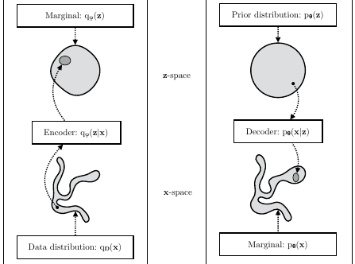
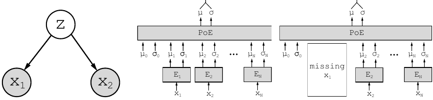
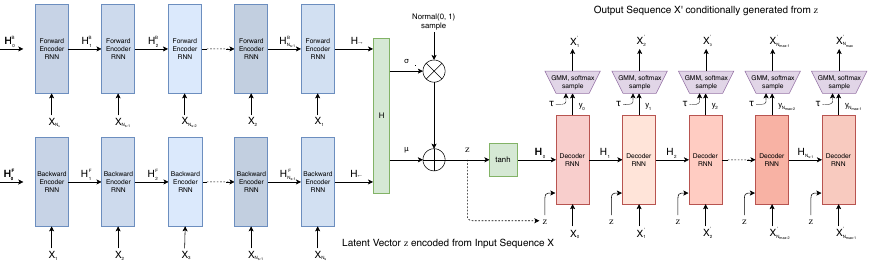
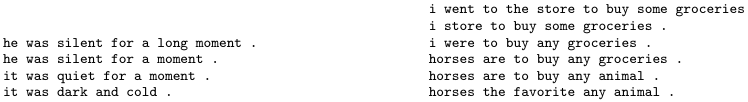
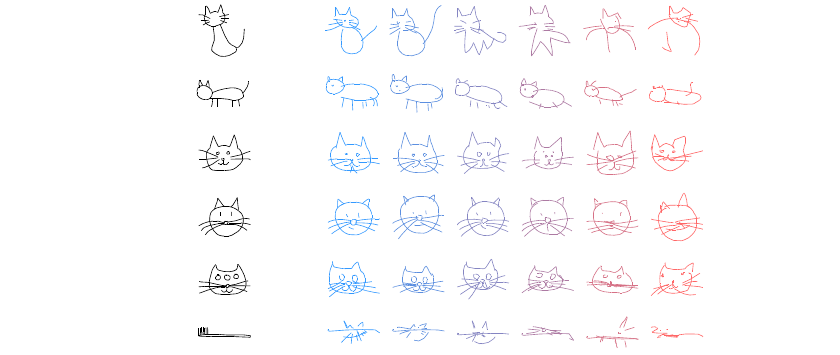

# 21.3 VAE 的推广

> 出处：Kevin P. Murphy,《Probabilistic Machine Learning: Advanced Topics》(MIT Press, 2023)，§21.3 VAE generalizations（含 §21.3.1–21.3.5 及其下层小节）。原书页码约 796–805。译法：忠实翻译（信达雅）。

本节讨论基本 VAE 模型的若干变体。

**图 21.4**：最大似然（ML）目标可视为对 $D_{KL}(p_D(x) \parallel p_\theta(x))$ 的最小化。（注：在图中 $p_D(x)$ 记作 $q_D(x)$。）ELBO 目标则是对 $D_{KL}(q_{D,\phi}(x,z) \parallel p_\theta(x,z))$ 的最小化，后者是 $D_{KL}(q_D(x) \parallel p_\theta(x))$ 的上界。取自 [[KW19a](../reference.md#KW19a)] 的图 2.4。承蒙 Durk Kingma 惠允使用。

## 21.3.1 β-VAE

VAE 常常会生成略显模糊的图像，如图 21.3、图 21.2 与图 20.9 所示。而对那些优化精确似然的模型（如 pixelCNN（见 22.3.2 节）和流模型（见第 23 章））而言，情况则非如此。要明白 VAE 为何不同，可考虑一种常见情形：解码器是一个具有固定方差的高斯分布，于是

$$
\log p_\theta(x|z) = -\frac{1}{2\sigma^2} \|x - d_\theta(z)\|_2^2 + \text{const}
\tag{21.23}
$$

令 $e_\phi(x) = \mathbb{E}[q_\phi(z|x)]$ 为 $x$ 的编码，并令 $X(z) = \{x : e_\phi(x) = z\}$ 为被映射到 $z$ 的输入集合。对于一个固定的推断网络，在使用平方重构损失时，生成器参数的最优设置是确保 $d_\theta(z) = \mathbb{E}[x : x \in X(z)]$。因此解码器应当预测所有映射到该 $z$ 的输入 $x$ 的平均值，这就导致了图像模糊。

我们可以通过提升后验近似的表达能力（避免将不同的输入并入同一个潜编码），或提升生成器的表达能力（把潜编码中缺失的信息补回来），或两者兼施，来解决这一问题。不过，一个更为简单的解决办法是减小对 KL 项的惩罚，使模型更接近一个确定性自编码器：

$$
\mathcal{L}_\beta(\theta, \phi | x) = \underbrace{-\mathbb{E}_{q_\phi(z|x)}[\log p_\theta(x|z)]}_{\mathcal{L}_E} + \underbrace{\beta\, D_{KL}(q_\phi(z|x) \parallel p_\theta(z))}_{\mathcal{L}_R}
\tag{21.24}
$$

其中 $\mathcal{L}_E$ 是重构误差（负对数似然），$\mathcal{L}_R$ 是 KL 正则项。这称为 β-VAE 目标 [[Hig+17a](../reference.md#Hig+17a)]。若令 $\beta = 1$，则恢复标准 VAE 所用的目标；若令 $\beta = 0$，则恢复标准自编码器所用的目标。

通过让 $\beta$ 从 0 变到无穷大，我们可以到达率失真曲线（rate distortion curve）上的不同点，如 5.4.2 节所讨论。这些点在重构误差（失真）与潜变量中所存储的关于输入的信息量（对应编码的码率）之间作出不同的权衡。使用 $\beta < 1$ 时，我们关于每个输入存储更多比特，因而能以较不模糊的方式重构图像。若使用 $\beta > 1$，则得到更为压缩的表示。

### 21.3.1.1 解耦表示

使用 $\beta > 1$ 的一个好处是它鼓励学习一种"解耦的（disentangled）"潜表示。直观地说，这意味着每个潜维度都表示输入中一个不同的变化因子。这常常用总相关（total correlation，见 5.3.5.1 节）来形式化，其定义如下：

$$
\text{TC}(z) = \sum_k H(z_k) - H(z) = D_{KL}\!\left(p(z) \,\Big\|\, \prod_k p_k(z_k)\right)
\tag{21.25}
$$

当且仅当 $z$ 的各分量两两相互独立、从而解耦时，该量为零。在 [[AS18](../reference.md#AS18)] 中，他们证明了使用 $\beta > 1$ 将会减小 TC。

遗憾的是，在 [[Loc+18](../reference.md#Loc+18)] 中，他们证明了非线性潜变量模型是不可辨识的（unidentifiable），因此对于任何一个解耦表示，都存在一个具有完全相同似然的、等价的完全纠缠（entangled）表示。因此，若不通过编码器、解码器、先验、数据集或学习算法选择恰当的归纳偏置（inductive bias），就不可能恢复出正确的潜表示；也就是说，仅仅调整 $\beta$ 是不够的。更多讨论见 32.4.1 节。

### 21.3.1.2 与信息瓶颈的联系

在本节中，我们将说明 β-VAE 是 5.6 节中信息瓶颈（information bottleneck，IB）目标的一个无监督版本。若输入为 $x$，隐藏瓶颈为 $z$，目标输出为 $\tilde{x}$，则无监督 IB 目标变为

$$
\mathcal{L}_{\text{UIB}} = \beta\, I(z; x) - I(z; \tilde{x})
\tag{21.26}
$$

$$
= \beta \mathbb{E}_{p(x,z)}\!\left[\log \frac{p(x,z)}{p(x)p(z)}\right] - \mathbb{E}_{p(z,\tilde{x})}\!\left[\log \frac{p(z,\tilde{x})}{p(z)p(\tilde{x})}\right]
\tag{21.27}
$$

其中

$$
p(x, z) = p_D(x)p(z|x)
\tag{21.28}
$$

$$
p(z, \tilde{x}) = \int p_D(x)p(z|x)p(\tilde{x}|z)\,dx
\tag{21.29}
$$

直观地说，式 (21.26) 中的目标意味着我们应当选取一个能够可靠预测 $\tilde{x}$、同时又不要记忆过多关于输入 $x$ 信息的表示 $z$。权衡参数由 $\beta$ 控制。

由式 (5.181)，我们对这个无监督目标有如下变分上界：

$$
\mathcal{L}_{\text{UVIB}} = -\mathbb{E}_{q_{D,\phi}(z,x)}[\log p_\theta(x|z)] + \beta \mathbb{E}_{p_D(x)}[D_{KL}(q_\phi(z|x) \parallel p_\theta(z))]
\tag{21.30}
$$

当对 $x$ 取平均时，它与式 (21.24) 相吻合。

## 21.3.2 InfoVAE

在 21.2.4 节中，我们讨论了训练 VAE 时标准 ELBO 目标的一些缺点，即：当解码器很强大时倾向于忽略潜编码（见 21.4 节），以及由于数据空间与潜空间中 KL 项之间的不匹配而倾向于学到较差的后验近似（见 21.2.4 节）。我们可以通过使用如下形式的广义目标在一定程度上修正这些问题：

$$
\mathcal{L}(\theta, \phi | x) = -\lambda D_{KL}(q_\phi(z) \parallel p_\theta(z)) - \mathbb{E}_{q_\phi(z)}[D_{KL}(q_\phi(x|z) \parallel p_\theta(x|z))] + \alpha\, I_q(x; z)
\tag{21.31}
$$

其中 $\alpha \geq 0$ 控制我们对 $x$ 与 $z$ 之间互信息 $I_q(x; z)$ 的加权程度，$\lambda \geq 0$ 控制 $z$ 空间 KL 与 $x$ 空间 KL 之间的权衡。这称为 InfoVAE 目标 [[ZSE19](../reference.md#ZSE19)]。若令 $\alpha = 0$ 且 $\lambda = 1$，则如式 (21.22) 所示恢复标准 ELBO。

遗憾的是，式 (21.31) 中的目标无法按所写的形式直接计算，原因在于其中难以处理的互信息项：

$$
I_q(x; z) = \mathbb{E}_{q_\phi(x,z)}\!\left[\log \frac{q_\phi(x,z)}{q_\phi(x)q_\phi(z)}\right] = -\mathbb{E}_{q_\phi(x,z)}\!\left[\log \frac{q_\phi(z)}{q_\phi(z|x)}\right]
\tag{21.32}
$$

不过，利用 $q_\phi(x|z) = p_D(x)q_\phi(z|x)/q_\phi(z)$ 这一事实，我们可以把目标改写如下：

$$
\mathcal{L} = \mathbb{E}_{q_\phi(x,z)}\!\left[-\lambda \log \frac{q_\phi(z)}{p_\theta(z)} - \log \frac{q_\phi(x|z)}{p_\theta(x|z)} - \alpha \log \frac{q_\phi(z)}{q_\phi(z|x)}\right]
\tag{21.33}
$$

$$
= \mathbb{E}_{q_\phi(x,z)}\!\left[\log p_\theta(x|z) - \log \frac{q_\phi(z)^{\lambda+\alpha-1}\, p_D(x)}{p_\theta(z)^\lambda\, q_\phi(z|x)^{\alpha-1}}\right]
\tag{21.34}
$$

$$
\begin{aligned}
&= \mathbb{E}_{p_D(x)}\big[\mathbb{E}_{q_\phi(z|x)}[\log p_\theta(x|z)]\big] - (1 - \alpha)\mathbb{E}_{p_D(x)}[D_{KL}(q_\phi(z|x) \parallel p_\theta(z))] \\
&\quad - (\alpha + \lambda - 1)D_{KL}(q_\phi(z) \parallel p_\theta(z)) - \mathbb{E}_{p_D(x)}[\log p_D(x)]
\end{aligned}
\tag{21.35}
$$

其中最后一项是一个可以忽略的常数。前两项可以用重参数化技巧（reparameterization trick）来优化。遗憾的是，最后一项需要计算 $q_\phi(z) = \int_x q_\phi(x, z)\,dx$，这是难以处理的。所幸我们可以很容易地从这个分布中采样，办法是采样 $x \sim p_D(x)$ 再采样 $z \sim q_\phi(z|x)$。因此 $q_\phi(z)$ 是一个隐式概率模型，类似于 GAN（见第 26 章）。只要我们使用一个严格散度（strict divergence），即满足当且仅当 $q = p$ 时 $D(q, p) = 0$，那么可以证明这并不影响该过程的最优性。具体而言，[[ZSE19](../reference.md#ZSE19)] 的命题 2 告诉我们如下结论：

**定理 1.** 设 $X$ 和 $Z$ 为连续空间，$\alpha < 1$（以使互信息有界）且 $\lambda > 0$。对于 $I_q(x; z)$ 的任何固定取值，采用任意严格散度 $D(q_\phi(z), p_\theta(z))$ 的近似 InfoVAE 损失，当 $p_\theta(x) = p_D(x)$ 且 $q_\phi(z|x) = p_\theta(z|x)$ 时取得全局最优。

### 21.3.2.1 与 MMD VAE 的联系

若令 $\alpha = 1$，InfoVAE 目标简化为

$$
\mathcal{L} \overset{c}{=} \mathbb{E}_{p_D(x)}\big[\mathbb{E}_{q_\phi(z|x)}[\log p_\theta(x|z)]\big] - \lambda D_{KL}(q_\phi(z) \parallel p_\theta(z))
\tag{21.36}
$$

MMD VAE[^3] 将上式中的 KL 散度替换为 2.7.3 节中定义的（平方）最大均值差异（maximum mean discrepancy）或称 MMD 散度。（基于上述定理，这样做是合理的。）这种方法相对于标准 InfoVAE 的优点在于，所得目标是可处理的。具体而言，若令 $\lambda = 1$ 并改变符号，便得到

$$
\mathcal{L} = \mathbb{E}_{p_D(x)}\big[\mathbb{E}_{q_\phi(z|x)}[-\log p_\theta(x|z)]\big] + \text{MMD}(q_\phi(z), p_\theta(z))
\tag{21.37}
$$

正如我们在 2.7.3 节中所讨论的，我们可以按如下方式计算 MMD：

$$
\text{MMD}(p, q) = \mathbb{E}_{p(z),p(z')}[K(z, z')] + \mathbb{E}_{q(z),q(z')}[K(z, z')] - 2\mathbb{E}_{p(z),q(z')}[K(z, z')]
\tag{21.38}
$$

其中 $K()$ 是某个核函数，例如 RBF 核 $K(z, z') = \exp\!\left(-\frac{1}{2\sigma^2}\|z - z'\|_2^2\right)$。直观地说，MMD 度量（在潜空间中）来自先验的样本与来自聚合后验（aggregated posterior）的样本之间的相似度。

在实践中，我们可以这样实现 MMD 目标：对当前小批量中的全部 $B$ 个样本使用后验预测均值 $z_n = e_\phi(x_n)$，并将其与来自 $\mathcal{N}(0, I)$ 先验的 $B$ 个随机样本相比较。

若我们使用具有固定方差的高斯解码器，则负对数似然就只是一个平方误差项：

$$
-\log p_\theta(x|z) = \|x - d_\theta(z)\|_2^2
\tag{21.39}
$$

于是整个模型是确定性的，只是分别在潜空间和可见空间中预测均值。

### 21.3.2.2 与 β-VAE 的联系

若令 $\alpha = 0$ 且 $\lambda = 1$，则回到原始的 ELBO。若 $\lambda > 0$ 任意选取，但令 $\alpha = 1 - \lambda$，则得到 β-VAE。

### 21.3.2.3 与对抗自编码器的联系

若令 $\alpha = 1$ 且 $\lambda = 1$，并将 $D$ 选为 Jensen-Shannon 散度（可以通过训练一个二元判别器来最小化，如 26.2.2 节所述），则得到一个称为对抗自编码器（adversarial autoencoder）的模型 [[Mak+15a](../reference.md#Mak+15a)]。

## 21.3.3 多模态 VAE

可以扩展 VAE 来构建不同种类变量（如图像与文本）上的联合分布。这有时称为多模态 VAE（multimodal VAE）或 MVAE。设有 $M$ 个模态。我们假设它们在给定潜编码的条件下相互独立，因而生成模型具有如下形式

$$
p_\theta(x_1, \dots, x_M, z) = p(z)\prod_{m=1}^{M} p_\theta(x_m|z)
\tag{21.40}
$$

其中我们将 $p(z)$ 视为一个固定先验。图 21.5(a) 给出了图示。

**图 21.5**：多模态 VAE 图示。(a) 含 $N = 2$ 个模态的生成模型。(b) 专家乘积（product of experts，PoE）推断网络由 $N$ 个独立的高斯专家 $E_i$ 推导而来。$\mu_0$ 和 $\sigma_0$ 是先验的参数。(c) 若某个模态缺失，则在后验中省略其贡献。取自 [[WG18](../reference.md#WG18)] 的图 1。承蒙 Mike Wu 惠允使用。

标准 ELBO 由下式给出

$$
\mathcal{L}(\theta, \phi | X) = \mathbb{E}_{q_\phi(z|X)}\!\left[\sum_m \log p_\theta(x_m|z)\right] - D_{KL}(q_\phi(z|X) \parallel p(z))
\tag{21.41}
$$

其中 $X = (x_1, \dots, x_M)$ 是观测数据。然而，不同的似然项 $p(x_m|z)$ 可能具有不同的动态范围（dynamic range）（例如，对像素使用高斯概率密度函数，对文本使用类别概率质量函数），所以我们为每个似然引入权重项 $\lambda_m \geq 0$。此外，令 $\beta \geq 0$ 控制 KL 正则化的程度。这便给出 ELBO 的加权版本，如下：

$$
\mathcal{L}(\theta, \phi | X) = \mathbb{E}_{q_\phi(z|X)}\!\left[\sum_m \lambda_m \log p_\theta(x_m|z)\right] - \beta D_{KL}(q_\phi(z|X) \parallel p(z))
\tag{21.42}
$$

我们往往并没有来自全部 $M$ 个模态的大量配对（对齐）数据。例如，我们可能拥有大量图像（模态 1）和大量文本（模态 2），但只有极少的（图像，文本）配对。因此，将损失加以推广、使之适配特征子集的边缘分布，是有用的。令模态 $m$ 被观测到（即 $x_m$ 已知）时 $O_m = 1$，缺失或未观测时 $O_m = 0$。令 $X = \{x_m : O_m = 1\}$ 为可见特征。我们现在使用如下目标：

$$
\mathcal{L}(\theta, \phi | X) = \mathbb{E}_{q_\phi(z|X)}\!\left[\sum_{m: O_m = 1} \lambda_m \log p_\theta(x_m|z)\right] - \beta D_{KL}(q_\phi(z|X) \parallel p(z))
\tag{21.43}
$$

关键问题在于，如何在给定不同特征子集的情况下计算后验 $q_\phi(z|X)$。一般而言这可能很困难，因为推断网络是一个判别式模型，它假设所有输入都可用。例如，如果它是在（图像，文本）配对 $q_\phi(z|x_1, x_2)$ 上训练的，我们如何仅给定一张图像来计算后验 $q_\phi(z|x_1)$，或仅给定文本来计算 $q_\phi(z|x_2)$？（一般而言，当我们有缺失输入时，VAE 都会出现这一问题。）

所幸，基于我们关于各模态之间条件独立的假设，我们可以通过计算该模型下的精确后验来求得给定输入集合时 $q_\phi(z|X)$ 的最优形式，其由下式给出

$$
p(z|X) = \frac{p(z)p(x_1, \dots, x_M|z)}{p(x_1, \dots, x_M)} = \frac{p(z)}{p(x_1, \dots, x_M)}\prod_{m=1}^{M} p(x_m|z)
\tag{21.44}
$$

$$
= \frac{p(z)}{p(x_1, \dots, x_M)}\prod_{m=1}^{M} \frac{p(z|x_m)p(x_m)}{p(z)}
\tag{21.45}
$$

$$
\propto p(z)\prod_{m=1}^{M} \frac{p(z|x_m)}{p(z)} \approx p(z)\prod_{m=1}^{M} \tilde{q}(z|x_m)
\tag{21.46}
$$

这可以视为一个专家乘积（product of experts，见 24.1.1 节），其中每个 $\tilde{q}(z|x_m)$ 是第 $m$ 个模态的一个"专家"，而 $p(z)$ 是先验。通过修改关于 $m$ 的乘积，我们可以对任何有数据的模态子集计算上述后验。如果我们对先验 $p(z) = \mathcal{N}(z|\mu_0, \Lambda_0^{-1})$ 与边缘后验比 $\tilde{q}(z|x_m) = \mathcal{N}(z|\mu_m, \Lambda_m^{-1})$ 都使用高斯分布，那么我们可以利用式 (2.154) 的结果来计算这些高斯分布的乘积：

$$
\prod_{m=0}^{M} \mathcal{N}(z|\mu_m, \Lambda_m^{-1}) \propto \mathcal{N}(z|\mu, \Sigma), \quad \Sigma = \left(\sum_m \Lambda_m\right)^{-1}, \quad \mu = \Sigma\left(\sum_m \Lambda_m \mu_m\right)
\tag{21.47}
$$

因此，总体后验精度（precision）是各个专家后验精度之和，而总体后验均值是各个专家后验均值的精度加权平均。图 21.5(b) 给出了图示。对于线性高斯（因子分析）模型，我们可以确保 $q(z|x_m) = p(z|x_m)$，此时上述解就是精确后验 [[WN18](../reference.md#WN18)]，但一般而言它将是一个近似。

我们既需要训练各个专家识别模型 $q(z|x_m)$，也需要训练联合模型 $q(z|X)$，从而使模型在测试时知道如何处理完全观测以及部分观测的输入。在 [[Ved+18](../reference.md#Ved+18)] 中，他们提出了一个相当复杂的"三重 ELBO（triple ELBO）"目标。在 [[WG18](../reference.md#WG18)] 中，他们提出了一种更简单的方法，即对完全观测的特征向量、所有边缘以及一组 $J$ 个随机选取的联合模态分别优化 ELBO：

$$
\mathcal{L}(\theta, \phi | X) = \mathcal{L}(\theta, \phi | (x_1, \dots, x_M)) + \sum_{m=1}^{M} \mathcal{L}(\theta, \phi | x_m) + \sum_{j \in J} \mathcal{L}(\theta, \phi | X_j)
\tag{21.48}
$$

这能很好地推广到半监督设定，即我们只有少量来自联合的对齐（"有标签"）样本，但有大量来自各个边缘的非对齐（"无标签"）样本。图 21.5(c) 给出了图示。

请注意，上述方案只能处理固定数量缺失模式的情形；我们可以将其推广，以允许任意缺失模式，如 [[CNW20](../reference.md#CNW20)] 中所讨论。（关于缺失数据更一般的讨论，另见 3.11 节。）

## 21.3.4 半监督 VAE

在本节中，我们讨论如何将 VAE 扩展到半监督学习设定，在该设定中我们既有有标签数据 $D_L = \{(x_n, y_n)\}$，也有无标签数据 $D_U = \{(x_n)\}$。我们聚焦于 [[Kin+14a](../reference.md#Kin+14a)] 中提出的 M2 模型。

生成模型具有如下形式：

$$
p_\theta(x, y) = p_\theta(y)p_\theta(x|y) = p_\theta(y)\int p_\theta(x|y, z)p_\theta(z)\,dz
\tag{21.49}
$$

其中 $z$ 是一个潜变量，$p_\theta(z) = \mathcal{N}(z|0, I)$ 是潜先验，$p_\theta(y) = \text{Cat}(y|\pi)$ 是标签先验，$p_\theta(x|y, z) = p(x|f_\theta(y, z))$ 是似然（例如高斯），其参数由 $f$（一个深度神经网络）计算。这种方法的主要创新在于，假设数据是依据一个潜类别变量 $y$ 以及连续潜变量 $z$ 二者共同生成的。类别变量 $y$ 对于有标签数据是观测的，对于无标签数据是未观测的。

为计算有标签数据的似然 $p_\theta(x, y)$，我们需要对 $z$ 边缘化，这可以通过使用如下形式的推断网络来完成

$$
q_\phi(z|y, x) = \mathcal{N}(z|\mu_\phi(y, x), \text{diag}(\sigma_\phi(y, x)))
\tag{21.50}
$$

然后我们使用如下变分下界

$$
\log p_\theta(x, y) \geq \mathbb{E}_{q_\phi(z|x,y)}[\log p_\theta(x|y, z) + \log p_\theta(y) + \log p_\theta(z) - \log q_\phi(z|x, y)] = -\mathcal{L}(x, y)
\tag{21.51}
$$

这与 VAE 的标准做法一致（见 21.2 节）。唯一的区别在于，我们观测到两种数据：$x$ 和 $y$。

为计算无标签数据的似然 $p_\theta(x)$，我们需要对 $z$ 和 $y$ 边缘化，这可以通过使用如下形式的推断网络来完成

$$
q_\phi(z, y|x) = q_\phi(z|x)q_\phi(y|x)
\tag{21.52}
$$

$$
q_\phi(z|x) = \mathcal{N}(z|\mu_\phi(x), \text{diag}(\sigma_\phi(x)))
\tag{21.53}
$$

$$
q_\phi(y|x) = \text{Cat}(y|\pi_\phi(x))
\tag{21.54}
$$

请注意，$q_\phi(y|x)$ 起着判别式分类器的作用，用以填补缺失的标签。然后我们使用如下变分下界：

$$
\log p_\theta(x) \geq \mathbb{E}_{q_\phi(z,y|x)}[\log p_\theta(x|y, z) + \log p_\theta(y) + \log p_\theta(z) - \log q_\phi(z, y|x)]
\tag{21.55}
$$

$$
= -\sum_y q_\phi(y|x)\mathcal{L}(x, y) + H(q_\phi(y|x)) = -\mathcal{U}(x)
\tag{21.56}
$$

请注意，判别式分类器 $q_\phi(y|x)$ 仅用于计算无标签数据的对数似然，这并不理想。因此我们可以在有监督数据上额外添加一个分类损失，从而得到如下总体目标函数：

$$
\mathcal{L}(\theta) = \mathbb{E}_{(x,y) \sim D_L}[\mathcal{L}(x, y)] + \mathbb{E}_{x \sim D_U}[\mathcal{U}(x)] + \alpha \mathbb{E}_{(x,y) \sim D_L}[-\log q_\phi(y|x)]
\tag{21.57}
$$

其中 $D_L$ 是有标签数据，$D_U$ 是无标签数据，$\alpha$ 是控制生成式学习与判别式学习相对权重的一个超参数。

**图 21.6**：带有双向 RNN 编码器和单向 RNN 解码器的 VAE 图示。输出生成器可以使用 GMM 和/或 softmax 分布。取自 [[HE18](../reference.md#HE18)] 的图 2。承蒙 David Ha 惠允使用。

## 21.3.5 带有序列编码器/解码器的 VAE

在本节中，我们讨论用于序列数据（如文本和生物序列）的 VAE，其中数据 $x$ 是一个变长序列，但我们有一个固定大小的潜变量 $z \in \mathbb{R}^K$。（在 29.13 节中我们考虑更一般的情形，即 $z$ 是一个变长的潜变量序列——称为序列 VAE（sequential VAE）或动态 VAE（dynamic VAE）。）我们要做的只是修改解码器 $p(x|z)$ 和编码器 $q(z|x)$，使其能够处理序列。

### 21.3.5.1 模型

如果我们对 VAE 的编码器和解码器使用 RNN，便得到一个称为 VAE-RNN 的模型，这是 [[Bow+16a](../reference.md#Bow+16a)] 中提出的。更详细地说，生成模型为 $p(z, x_{1:T}) = p(z)\text{RNN}(x_{1:T}|z)$，其中 $z$ 可以作为 RNN 的初始状态注入，或作为每个时间步的输入注入。推断模型为 $q(z|x_{1:T}) = \mathcal{N}(z|\mu(h), \Sigma(h))$，其中 $h = [h^\rightarrow_T, h^\leftarrow_1]$ 是应用于 $x_{1:T}$ 的双向 RNN 的输出。图 21.6 给出了图示。

最近，人们尝试将 transformer 与 VAE 相结合。例如，在 [[Li+20](../reference.md#Li+20)] 的 Optimus 模型中，他们对编码器使用了一个 BERT 模型。更详细地说，编码器 $q(z|x)$ 由与一个虚设词元（dummy token）相关联的嵌入向量推导而来，该词元对应于"类别标签"，被附加到输入序列 $x$ 上。解码器是一个标准的自回归模型（类似于 GPT），带有一个额外输入，即潜向量 $z$。他们考虑了两种注入潜向量的方式。最简单的方法是在解码步骤中把 $z$ 加到每个词元的嵌入层上，做法是定义 $h'_i = h_i + Wz$，其中 $h_i \in \mathbb{R}^H$ 是第 $i$ 个词元的原始嵌入，$W \in \mathbb{R}^{H \times K}$ 是一个解码矩阵，$K$ 是潜向量的大小。然而，在他们的实验中，让解码器的所有层都关注（attend to）潜编码 $z$ 能取得更好的结果。一种简便的实现方式是定义记忆向量 $h_m = Wz$，其中 $W \in \mathbb{R}^{LH \times K}$，$L$ 是解码器的层数，然后将 $h_m \in \mathbb{R}^{L \times H}$ 附加到每一层的所有其他嵌入上。

[[Gre20](../reference.md#Gre20)] 中提出了另一种方法，称为 transformer VAE。该模型使用一个漏斗 transformer（funnel transformer）[[Dai+20b](../reference.md#Dai+20b)] 作为编码器，并使用 T5 [[Raf+20a](../reference.md#Raf+20a)] 条件 transformer 作为解码器。此外，它使用一个 MMD VAE（见 21.3.2.1 节）来避免后验坍缩。

**图 21.7**：(a) 在两个句子（位于第一行和最后一行）之间进行插值时，从一个 VAE 文本模型的潜空间中采样得到的样本。请注意，中间的句子在语法上是正确的，并且在语义上与其相邻句子相关。取自 [[Bow+16b](../reference.md#Bow+16b)] 的表 8。(b) 与 (a) 相同，但现在使用一个确定性自编码器（具有相同的 RNN 编码器和解码器）。取自 [[Bow+16b](../reference.md#Bow+16b)] 的表 1。承蒙 Sam Bowman 惠允使用。

### 21.3.5.2 应用

在本节中，我们讨论 VAE 在序列数据上的一些应用。

**文本**

在 [[Bow+16b](../reference.md#Bow+16b)] 中，他们将 VAE-RNN 模型应用于自然语言句子。（相关工作另见 [[MB16](../reference.md#MB16); [SSB17](../reference.md#SSB17)]。）虽然这在标准的困惑度（perplexity）度量（即在给定前面的词时预测下一个词）方面并未提升性能，但它确实提供了一种推断句子语义表示的途径。这一表示随后可以用于潜空间插值，如 20.3.5 节所讨论。用 VAE-RNN 这样做的结果在图 21.7a 中给出了图示。（[[Li+20](../reference.md#Li+20)] 中使用 VAE-transformer 展示了类似的结果。）相比之下，如果我们使用一个标准的确定性自编码器，配以相同的 RNN 编码器和解码器网络，则学到的空间意义要差得多，如图 21.7b 所示。原因在于，确定性自编码器的潜空间中存在"空洞（holes）"，这些空洞会被解码为无意义的输出。

然而，由于 RNN（以及 transformer）是强大的解码器，我们需要解决后验坍缩（posterior collapse）的问题，这将在 21.4 节中讨论。避免这一问题的一种常见办法是使用 KL 退火（KL annealing），但一种更有效的方法是使用 21.3.2 节的 InfoVAE 方法，其中包括对抗自编码器（[[She+20](../reference.md#She+20)] 中配合 RNN 解码器使用）和 MMD 自编码器（[[Gre20](../reference.md#Gre20)] 中配合 transformer 解码器使用）。

**草图**

在 [[HE18](../reference.md#HE18)] 中，他们将 VAE-RNN 模型应用于生成各种动物和手写字符的草图（线条画）。他们把自己的模型称为 sketch-rnn。训练数据记录了笔位置 $(x, y)$ 的序列，以及笔是否触及纸面。发射模型（emission model）对实值的位置偏移使用 GMM，对离散状态使用类别 softmax 分布。

**图 21.8**：sketch-RNN 模型对猫的条件生成。我们从左到右增大温度参数。取自 [[HE18](../reference.md#HE18)] 的图 5。承蒙 David Ha 惠允使用。

图 21.8 展示了来自各个类条件模型的一些样本。我们改变发射模型的温度参数 $\tau$ 来控制生成器的随机性。（更确切地说，我们将 GMM 的方差乘以 $\tau$，并在重新归一化之前将离散概率除以 $\tau$。）当温度较低时，模型力图尽可能贴近地重构输入。然而，当输入对训练集来说不典型时（例如，一只三只眼睛的猫，或一把牙刷），重构会被"正则化"，趋向于一只有两只眼睛的标准猫，但仍保留输入的一些特征。

**分子设计**

在 [[GB+18](../reference.md#GB+18)] 中，他们使用 VAE-RNN 来对分子图结构建模，该结构用 SMILES 表示法[^4] 表示为一个字符串。也可以学习一个从潜空间到某个感兴趣的标量量（如某分子的溶解度或药效）的映射。然后，我们可以在连续潜空间中进行基于梯度的优化，以尝试生成使该量最大化的新图。该方法的示意图见图 21.9。

主要问题在于，要确保潜空间中的点能解码为有效的字符串/分子。对此有多种解决方案，包括使用语法 VAE（grammar VAE），其中 RNN 解码器被替换为一个随机上下文无关文法（stochastic context free grammar）。细节见 [[KPHL17](../reference.md#KPHL17)]。

[^3]: 在 https://ermongroup.github.io/blog/a-tutorial-on-mmd-variational-autoencoders/ 中提出。

[^4]: 见 https://en.wikipedia.org/wiki/Simplified_molecular-input_line-entry_system 。
