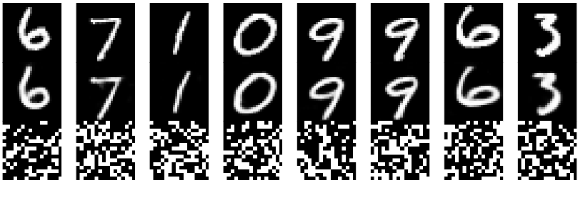
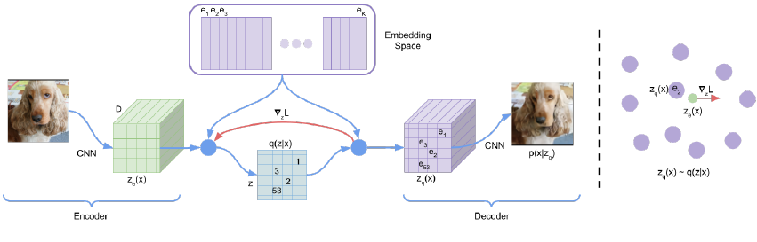
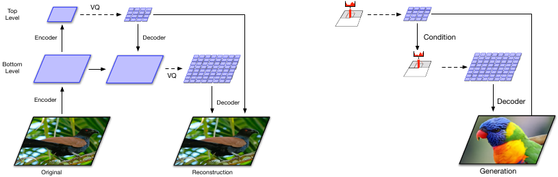
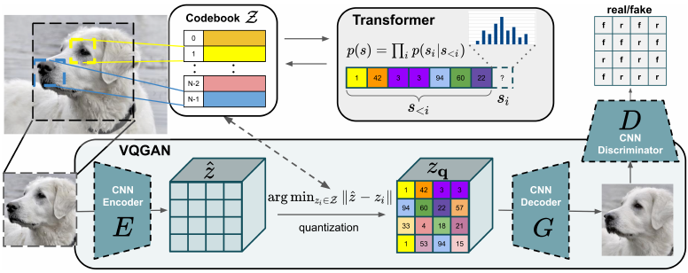

# 21.6 向量量化 VAE（VQ-VAE）

> 出处：Kevin P. Murphy,《Probabilistic Machine Learning: Advanced Topics》(MIT Press, 2023)，§21.6 Vector quantization VAE，原书页码约 815–820。忠实翻译（信达雅）。

**图 21.15**：使用 256 个二值隐变量的 MNIST 自编码器。第一行：输入图像。第二行：重构结果。第三行：隐编码，重整为 16 × 16 的图像。由 quantized_autoencoder_mnist.ipynb 生成。

本节介绍 VQ-VAE，它代表"向量量化 VAE（vector quantized VAE）"[[OVK17](../reference.md#OVK17); [ROV19](../reference.md#ROV19)]。它与标准 VAE 类似，区别在于它使用一组离散隐变量。

## 21.6.1 带二值编码的自编码器

解决该问题的最简单方法，是构造一个标准 VAE，但在编码器末端添加一个离散化层，$z_e(x) \in \{0, \ldots, S-1\}^K$，其中 $S$ 是状态数，$K$ 是离散隐变量的个数。例如，我们可以通过将 $z$ 裁剪到 $\{0, 1\}^K$ 内，把隐向量二值化（使用 $S = 2$）。这对数据压缩可能很有用（参见例如 [[BLS17](../reference.md#BLS17)]）。

假设我们设隐编码上的先验为均匀分布。由于编码器是确定性的，KL 散度退化为一个常数，等于 $\log K$。这避免了后验坍缩（posterior collapse）的问题（见 21.4 节）。遗憾的是，编码器中不连续的量化操作使得无法直接使用基于梯度的优化。[[OVK17](../reference.md#OVK17)] 提出的解决方案是使用直通估计器（straight-through estimator），我们将在 6.3.8 节讨论它。我们在图 21.15 中展示了该方法的一个简单示例，其中我们使用高斯似然，因此损失函数形式为

$$L = ||x − d(e(x))||_2^2 \tag{21.75}$$

其中 $e(x) \in \{0, 1\}^K$ 是编码器，$d(z) \in \mathbb{R}^{28 \times 28}$ 是解码器。

## 21.6.2 VQ-VAE 模型

我们可以通过使用一个三维的离散隐变量张量得到更具表达力的模型，$z \in \mathbb{R}^{H \times W \times K}$，其中 $K$ 是每个隐变量的离散取值数。我们不再仅仅把连续向量 $z_e(x)_{ij}$ 二值化，而是将其与一个嵌入向量的码本（codebook）$\{e_k : k = 1:K, e_k \in \mathbb{R}^D\}$ 进行比较，然后把 $z_{ij}$ 设为最近码本条目的索引：

$$
q(z_{ij} = k|x) = \begin{cases}
1 & \text{if } k = \arg\min_{k'} ||z_e(x)_{i,j,:} − e_{k'}||_2 \\
0 & \text{otherwise}
\end{cases}
\tag{21.76}
$$

**图 21.16**：VQ-VAE 架构。取自 [[OVK17](../reference.md#OVK17)] 的图 1。蒙 Aäron van den Oord 惠允使用。

在重构输入时，我们用相应的实值码本向量替换每个离散编码索引：

$$(z_q)_{ij} = e_k \quad \text{where } z_{ij} = k \tag{21.77}$$

随后，这些值像往常一样被传递给解码器 $p(x|z_q)$。整体架构的图示见图 21.16。注意，尽管 $z_q$ 是由码本向量的离散组合生成的，但分布式编码的使用使得该模型非常具有表达力。例如，如果我们使用一个 $32 \times 32$ 的网格、$K = 512$，那么我们可以生成 $512^{32 \times 32} = 2^{9216}$ 幅不同的图像，这是一个天文数字般庞大的数目。

为了拟合该模型，我们可以像之前一样，使用直通估计器最小化负对数似然（重构误差）。这相当于把梯度从解码器输入 $z_q(x)$ 传递到编码器输出 $z_e(x)$，绕过公式 (21.76)，如图 21.16 中红色箭头所示。遗憾的是，这意味着码本条目将得不到任何学习信号。为解决这一问题，作者提出在损失中添加一个额外项，称为码本损失（codebook loss），它促使码本条目 $e$ 与编码器的输出相匹配。我们把编码器 $z_e(x)$ 当作一个固定目标，方法是对它施加一个停止梯度（stop gradient）算子；这确保了 $z_e$ 在前向传播中被正常处理，但在反向传播中具有零梯度。修改后的损失（略去空间索引 $i, j$）变为

$$L = − \log p(x|z_q(x)) + ||\text{sg}(z_e(x)) − e||_2^2 \tag{21.78}$$

其中 $e$ 指分配给 $z_e(x)$ 的码本向量，$\text{sg}$ 是停止梯度算子。

更新码本向量的另一种方法是使用移动平均（moving averages）。为了解其工作原理，首先考虑批处理（batch）设定。令 $\{z_{i,1}, \ldots, z_{i,n_i}\}$ 为编码器输出中与字典项 $e_i$ 最接近的 $n_i$ 个输出所组成的集合。我们可以更新 $e_i$ 以最小化均方误差（MSE）

$$\sum_{j=1}^{n_i} ||z_{i,j} − e_i||_2^2 \tag{21.79}$$

它具有闭式更新

$$e_i = \frac{1}{n_i} \sum_{j=1}^{n_i} z_{i,j} \tag{21.80}$$

这就像拟合 GMM 的均值向量时 EM 算法的 M 步。在小批量（minibatch）设定下，我们将上述运算替换为指数移动平均，如下所示：

$$N_i^t = \gamma N_i^{t-1} + (1 - \gamma) n_i^t \tag{21.81}$$

$$m_i^t = \gamma m_i^{t-1} + (1 - \gamma) \sum_j z_{i,j}^t \tag{21.82}$$

$$e_i^t = \frac{m_i^t}{N_i^t} \tag{21.83}$$

作者发现 $\gamma = 0.9$ 效果良好。

上述过程会学习更新码本向量，使其与编码器的输出相匹配。然而，确保编码器不要过于频繁地"改变主意"（关于该使用哪个码本值）同样重要。为防止这一点，作者提出在损失中添加第三项，称为承诺损失（commitment loss），它促使编码器输出接近码本值。于是我们得到最终的损失：

$$L = − \log p(x|z_q(x)) + ||\text{sg}(z_e(x)) − e||_2^2 + \beta ||z_e(x) − \text{sg}(e)||_2^2 \tag{21.84}$$

作者发现 $\beta = 0.25$ 效果良好，当然该值取决于重构损失（NLL）项的尺度。（关于该损失的一种概率解释，可见 [[Hen+18](../reference.md#Hen+18)]。）总体而言，解码器只优化第一项，编码器优化第一项和最后一项，而嵌入向量优化中间那一项。

## 21.6.3 学习先验

在训练完 VQ-VAE 模型之后，我们有可能学习一个更好的先验，以匹配聚合后验（aggregated posterior）。为此，我们只需把编码器应用于一组数据 $\{x_n\}$，从而将它们转换为离散序列 $\{z_n\}$。随后我们就可以用任意一种序列模型学习一个联合分布 $p(z)$。在最初的 VQ-VAE 论文 [[OVK17](../reference.md#OVK17)] 中，他们使用了因果卷积的 PixelCNN 模型（见 22.3.2 节）。较新的工作则使用了 transformer 解码器（见 22.4 节）。来自该先验的样本随后可以用 VQ-VAE 模型的解码器部分进行解码。我们在下面的各节中给出若干这样的示例。

## 21.6.4 层次化扩展（VQ-VAE-2）

在 [[ROV19](../reference.md#ROV19)] 中，他们通过使用层次化的隐编码扩展了最初的 VQ-VAE 模型。该模型如图 21.17 所示。他们将其应用于尺寸为 $256 \times 256 \times 3$ 的图像。第一隐变量层将其映射为尺寸 $64 \times 64$ 的量化表示，第二隐变量层将其映射为尺寸 $32 \times 32$ 的量化表示。这一层次化方案使得顶层能够专注于图像的高层语义，而把诸如纹理之类的精细视觉细节留给较低层。（关于层次化 VAE 的更多讨论，见 21.5 节。）

**图 21.17**：VQ-VAE 的层次化扩展。(a) 编码器与解码器架构。(b) 将 Pixel-CNN 先验与解码器相结合。取自 [[ROV19](../reference.md#ROV19)] 的图 2。蒙 Aaron van den Oord 惠允使用。

拟合完 VQ-VAE 之后，他们使用一个增强了自注意力（self-attention，见 16.2.7 节）的 PixelCNN 模型来学习顶层编码上的先验，以捕捉长程依赖。（这一混合模型被称为 PixelSNAIL [[Che+17c](../reference.md#Che+17c)]。）对于较低层的先验，他们只使用标准的 PixelCNN，因为注意力的代价过于高昂。来自该模型的样本随后可以用 VQ-VAE 解码器进行解码，如图 21.17 所示。

## 21.6.5 离散 VAE

在 VQ-VAE 中，我们对隐变量使用独热（one-hot）编码，$q(z = k|x) = 1$ 当且仅当 $k = \arg\min_k ||z_e(x) − e_k||_2$，然后设 $z_q = e_k$。这并未捕捉隐编码中的任何不确定性，并且需要使用直通估计器进行训练。

人们已经研究了其他各种用离散隐编码拟合 VAE 的方法。在 DALL-E 论文（见 22.4.2 节）中，他们使用了一种相当简单的方法，基于对离散变量使用 Gumbel-softmax 松弛（见 6.3.6 节）。简而言之，令 $q(z = k|x)$ 为输入 $x$ 被分配到码本条目 $k$ 的概率。我们可以通过计算 $w_k = \arg\max_k g_k + \log q(z = k|x)$ 从该分布中精确采样 $w_k \sim q(z = k|x)$，其中每个 $g_k$ 都来自一个 Gumbel 分布。现在我们可以通过使用一个带温度 $\tau > 0$ 的 softmax 来"松弛"它，并计算

$$w_k = \frac{\exp(\frac{g_k + \log q(z=k|x)}{\tau})}{\sum_{j=1}^{K} \exp(\frac{g_j + \log q(z=j|x)}{\tau})} \tag{21.85}$$

现在我们把隐编码设为码本向量的加权和：

$$z_q = \sum_{k=1}^{K} w_k e_k \tag{21.86}$$

在 $\tau \to 0$ 的极限下，权重 $w$ 上的分布收敛为一个独热分布，此时 $z$ 等于码本条目之一。但对于有限的 $\tau$，我们"填充"了这些向量之间的空间。

**图 21.18**：VQ-GAN 图示。取自 [[ERO21](../reference.md#ERO21)] 的图 2。蒙 Patrick Esser 惠允使用。

这使得我们能够以通常的可微方式表达 ELBO：

$$L = −\mathbb{E}_{q(z|x)}[\log p(x|z)] + \beta D_{KL}(q(z|x) \| p(z)) \tag{21.87}$$

其中 $\beta > 0$ 控制正则化的强度。（与 VQ-VAE 不同，这里的 KL 项不是常数，因为编码器是随机的。）此外，由于 Gumbel 噪声变量是从一个独立于编码器参数的分布中采样的，我们可以使用重参数化技巧（reparameterization trick，见 6.3.5 节）来优化它。

## 21.6.6 VQ-GAN

VQ-VAE 的一个缺点是，它在重构损失中使用均方误差，这可能导致样本模糊。在 VQ-GAN 论文 [[ERO21](../reference.md#ERO21)] 中，他们将其替换为一个（逐图块的，patch-wise）GAN 损失（见第 26 章），并结合一个感知损失（perceptual loss）；这带来了高得多的视觉保真度。此外，他们使用一个 transformer（见 16.3.5 节）来建模隐编码上的先验。整体模型的可视化见图 21.18。在 [[Yu+21](../reference.md#Yu+21)] 中，他们用 transformer 替换了 VQ-GAN 模型的 CNN 编码器和解码器，取得了改进的结果；他们将其称为 VIM（vector-quantized image modeling，向量量化图像建模）。
