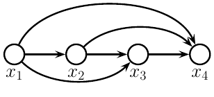

# 22.1 引言

> 出处：Kevin Murphy《Probabilistic Machine Learning: Advanced Topics》（MIT Press, 2023）
> 节号：§22.1　原书页码：约 821
> 译法：忠实翻译（信达雅）

根据概率的链式法则（chain rule），我们可以将任意 $T$ 个变量上的联合分布写成如下形式：

$$
p(x_{1:T}) = p(x_1)p(x_2|x_1)p(x_3|x_2,x_1)p(x_4|x_3,x_2,x_1)\ldots = \prod_{t=1}^{T} p(x_t|x_{1:t-1}) \tag{22.1}
$$

其中 $x_t \in \mathcal{X}$ 是第 $t$ 个观测，并且我们定义 $p(x_1|x_{1:0}) = p(x_1)$ 为初始状态分布。这称为自回归模型（autoregressive model, ARM）。它对应于一个全连接的有向无环图（DAG），其中每个节点都依赖于其在排序中的全部前驱节点，如图 22.1 所示。这类模型也可以以任意的输入或上下文 $c$ 为条件，从而定义 $p(x|c)$，不过为了记号简洁，我们略去这一点。

当然，我们也可以在时间上“反向”地对联合分布进行因子分解，使用

$$
p(x_{1:T}) = \prod_{t=T}^{1} p(x_t|x_{t+1:T}) \tag{22.2}
$$

然而，这种“反因果”（anti-causal）方向往往更难学习（参见例如 [[PJS17](../reference.md#PJS17)]）。

尽管式 (22.1) 中的分解是通用的，但该表达式中的每一项（即每个条件分布 $p(x_t|x_{1:t-1})$）会变得越来越复杂，因为它依赖于数量不断增加的自变量，这使得这些项的计算变慢，也使得对其参数的估计更加依赖数据（参见第 2.6.3.2 节）。

解决这种难处理性（intractability）的一种方法是作出（一阶）马尔可夫假设（Markov assumption），由此产生一个马尔可夫模型 $p(x_t|x_{1:t-1}) = p(x_t|x_{t-1})$，我们将在第 2.6 节中讨论。（这也称为一阶自回归模型。）遗憾的是，马尔可夫假设具有很强的局限性。放松这一假设、使 $x_t$ 依赖于全部过去的 $x_{1:t-1}$ 而无需显式地对它们进行回归的一种途径，是假设过去可以被压缩进一个隐藏状态 $z_t$ 中。如果 $z_t$ 是过去观测 $x_{1:t-1}$ 的一个确定性函数，那么所得到的模型被称为循环神经网络（recurrent neural network），将在第 16.3.4 节中讨论。如果 $z_t$ 是过去隐藏状态 $z_{t-1}$ 的一个随机函数，那么所得到的模型被称为隐马尔可夫模型（hidden Markov model），我们将在第 29.2 节中讨论。

另一种方法是仍然采用式 (22.1) 的通用自回归（AR）模型，但对条件分布 $p(x_t|x_{1:t-1})$ 使用一种受限的函数形式，例如某种神经网络。这样一来，我们不作条件独立性假设，也不显式地将过去压缩为一个充分统计量（sufficient statistic），而是隐式地学习一个从过去到未来的紧凑映射。在下文各节中，我们将讨论这些条件分布的不同函数形式。

**图 22.1**：一个全连接的自回归模型。

这类自回归模型的主要优点在于，计算并优化每个序列（数据向量）的精确似然（likelihood）是容易的。其主要缺点在于，生成样本本质上是顺序进行的，这可能会很慢。此外，该方法并不学习数据的紧凑潜在表示（latent representation）。
