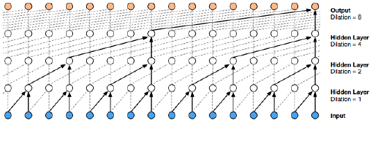
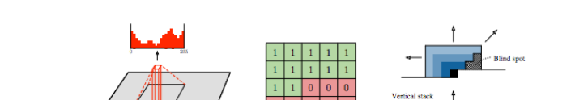

# 22.3 因果 CNN

> 出处：Kevin P. Murphy,《Probabilistic Machine Learning: Advanced Topics》(MIT Press, 2023)，§22.3 Causal CNNs；原书页码约 822–824。忠实翻译（信达雅）。

表示分布 $p(x_t|x_{1:t-1})$ 的一种方法，是设法识别过去历史中可能预示 $x_t$ 取值的模式。如果我们假设这些模式可以出现在任意位置，那么使用卷积神经网络（convolutional neural network）来检测它们就是合理的。然而，我们需要确保只把卷积掩码施加于过去的输入，而非未来的输入。这可以通过掩码卷积（masked convolution，也称因果卷积，causal convolution）来实现。我们将在下文中作更详细的讨论。

**图 22.2**：对 wavenet 模型的图示，其使用扩张（带孔）卷积（dilated (atrous) convolutions），扩张因子分别为 1、2、4 和 8。取自 [[Oor+16a](../reference.md#Oor+16a)] 的图 3。蒙 Aäron van den Oord 惠允使用。

## 22.3.1 一维因果 CNN（卷积马尔可夫模型）

考虑用于一维离散序列的如下卷积马尔可夫模型（convolutional Markov model）：

$$p(x_{1:T}) = \prod_{t=1}^{T} p(x_t|x_{1:t-1}; \theta) = \prod_{t=1}^{T} \mathrm{Cat}\left(x_t \,\middle|\, \mathrm{softmax}\left(\phi\left(\sum_{\tau=1}^{t-k} w^{\mathsf{T}} x_{\tau:\tau+k}\right)\right)\right) \tag{22.4}$$

其中 $w$ 是大小为 $k$ 的卷积滤波器，并且为记号简便起见，我们假设只有单个非线性 $\phi$ 以及类别型（categorical）输出。这与常规的一维卷积类似，只不过我们把未来的输入"掩蔽掉"（mask out），使得 $x_t$ 只依赖于过去的取值。我们当然可以使用更深的模型，也可以以输入特征 $c$ 为条件。

为了捕捉长程依赖（long-range dependencies），我们可以使用扩张卷积（dilated convolution，见 [Mur22, Sec 14.4.1]）。该模型已被成功用于构建一套最先进的文本转语音（text to speech, TTS）合成系统，称为 wavenet [[Oor+16a](../reference.md#Oor+16a)]。图示见图 22.2。

wavenet 模型是一个条件模型 $p(x|c)$，其中 $c$ 是从一段输入词序列导出的一组语言学特征，$x$ 是原始音频。tacotron 系统 [[Wan+17c](../reference.md#Wan+17c)] 是一种完全端到端的方法，其输入是词而非语言学特征。

虽然 wavenet 能产生高质量的语音，但它对于生产系统而言太慢了。不过，它可以被"蒸馏"（distilled）成一个并行的生成模型 [[Oor+18](../reference.md#Oor+18)]，这一点我们将在 23.2.4.3 节中讨论。

## 22.3.2 二维因果 CNN（PixelCNN）

我们可以把因果卷积扩展到二维，从而得到如下形式的自回归模型：

$$p(x|\theta) = \prod_{r=1}^{R} \prod_{c=1}^{C} p(x_{r,c}|f_\theta(x_{1:r-1,1:C}, x_{r,1:c-1})) \tag{22.5}$$

其中 $R$ 是行数，$C$ 是列数，并且我们按光栅扫描（raster scan）顺序，以所有先前生成的像素为条件，如图 22.3 所示。这称为 pixelCNN 模型 [[Oor+16b](../reference.md#Oor+16b)]。从该模型进行朴素采样（生成）耗时 $O(N)$，其中 $N=RC$ 是像素数，但 [[Ree+17](../reference.md#Ree+17)] 展示了如何使用多尺度（multiscale）方法将复杂度降至 $O(\log N)$。

**图 22.3**：PixelCNN 模型中因果二维卷积的图示。红色直方图显示了单个 RGB 通道单个像素离散化取值上的经验分布。红绿相间的 $5\times5$ 阵列显示了二值掩码，它选取左上方的上下文，以确保卷积是因果的。右侧的图示说明了我们如何通过使用一个包含所有先前各行的垂直上下文栈（vertical context stack）和一个仅包含当前行取值的水平上下文栈（horizontal context stack），来避免盲区（blind spots）。取自 [[Oor+16b](../reference.md#Oor+16b)] 的图 1。蒙 Aaron van den Oord 惠允使用。

人们已经提出了该模型的多种扩展。[[Sal+17d](../reference.md#Sal+17d)] 的 pixelCNN++ 模型通过使用逻辑斯谛分布混合（mixture of logistic distributions）来捕捉 $p(x_i|x_{1:i-1})$ 的多峰性（multimodality），从而提升了质量。[[OKK16](../reference.md#OKK16)] 的 pixelRNN 将掩码卷积与 RNN 相结合，以获得更长程的上下文依赖。[[MK19](../reference.md#MK19)] 的子尺度像素网络（Subscale Pixel Network）提出按如下方式生成像素：先采样高位比特，再采样低位比特，这使得高分辨率细节可以以整幅图像的低分辨率版本为条件来采样，而非仅以左上角为条件。
