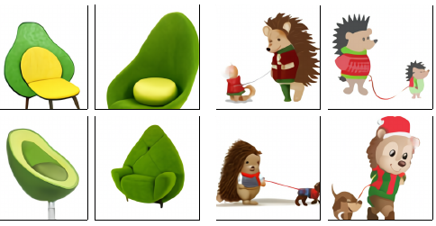

# 22.4 Transformer

> 出处：Kevin P. Murphy,《Probabilistic Machine Learning: Advanced Topics》(MIT Press, 2023)，§22.4 Transformers（含全部子节）。原书页码约 824–828。忠实翻译（信达雅）。

我们已在第 16.3.5 节中引入了 Transformer。它们既可以用于对序列进行编码（如在 BERT 中），也可以用于对序列进行解码（生成）。我们还可以将二者结合，使用编码器-解码器（encoder-decoder）组合，以实现从 $p(y|c)$ 出发的条件生成。另一种做法是定义一个联合序列模型 $p(c, y)$，其中 $c$ 为条件信息或上下文提示（context prompt），随后只需将 $c$ 作为初始上下文给入，即可对该联合模型施加条件。

解码器（生成器）的工作方式如下。在每一步 $t$，模型对前 $t$ 个输入 $y_{1:t}$ 施加掩码（因果）自注意力（masked (causal) self-attention，第 16.2.7 节），以计算出一组注意力权重 $a_{1:t}$。由此它计算出一个激活向量 $z_t = \sum_{\tau=1}^{t} a_\tau y_\tau$。该向量随后被送入一个前馈层，以计算 $h_t = \mathrm{MLP}(z_t)$。这一过程在模型中的每一层上重复进行。最后，输出被用于预测序列中的下一个元素，$y_{t+1} \sim \mathrm{Cat}(\mathrm{softmax}(W h_t))$。

在训练时，所有预测可以并行发生，因为作为目标的生成序列已经可用。也就是说，第 $t$ 个输出 $y_t$ 可以在给定输入 $y_{1:t-1}$ 的条件下被预测，而这对所有 $t$ 都可以同时完成。然而在测试时，模型必须按顺序施加，因此在 $t+1$ 处生成的输出会被反馈回模型，以预测 $t+2$，依此类推。注意，Transformer 的运行时间为 $O(T^2)$，尽管已经开发出多种更高效的版本（详见例如 [Mur22, Sec 15.6]）。

Transformer 是许多流行的（条件）序列生成模型的基础。下面我们给出若干示例。

## 22.4.1 文本生成（GPT 等）

在 [[Rad+18](../reference.md#Rad+18)] 中，OpenAI 提出了一个名为 GPT 的模型，它是“生成式预训练 Transformer”（Generative Pre-training Transformer）的简称。这是一个仅含解码器（decoder-only）的 Transformer 模型，使用因果（掩码）注意力。在 [[Rad+19](../reference.md#Rad+19)] 中，他们提出了 GPT-2，它是 GPT 的一个更大的版本（XL 版本有 15 亿参数，即 6.5GB），在一个大型网络语料库上训练（800 万个网页，即 40GB）。他们还简化了训练目标，仅使用最大似然进行训练。在 GPT-2 之后，OpenAI 发布了 GPT-3 [[Bro+20d](../reference.md#Bro+20d)]，它是 GPT-2 的一个更大的版本（1750 亿参数），在更多的数据上训练（3000 亿个词），但基于相同的原理。（据估计，训练耗费了 355 个 GPU 年，成本为 460 万美元。）

最近，OpenAI 发布了 ChatGPT [Ope]，它是 GPT-3 的一个改进版本，经过训练后能够进行交互式对话，所采用的技术称为基于人类反馈的强化学习（reinforcement learning from human feedback，RLHF），这一技术最早在 InstructGPT 论文 [[Ouy+22](../reference.md#Ouy+22)] 中引入。它使用诸如 PPO（第 35.3.4 节）之类的强化学习技术来微调模型，使其生成的回复与人类意图更为“对齐”（aligned），这里的人类意图由一个排序模型估计，而该排序模型是在有监督数据上预训练的。

这种形式的、在极大规模数据集上训练的大型模型，通常被称为大语言模型（large language model，LLM）（见例如 [[Bur25](../reference.md#Bur25)]）或基础模型（foundation models）[[Cen21](../reference.md#Cen21)]。如今许多此类模型都可在网络上获取。

LLM 背后的基本思想相当简单（对一个自回归 Transformer 进行最大似然训练），并且可以用大约 300 行代码实现。[^1] 然而，仅仅通过扩大模型与数据集的规模，似乎就能涌现出质上全新的能力（见例如 [[Wei+22](../reference.md#Wei+22)]）。

例如，可以在提示中包含若干输入-输出映射的示例，然后要求模型预测某个新输入所对应的输出。也就是说，提示中包含 $(x_i, y_i)$（$i = 1:N$），外加测试输入 $x_*$，模型随后生成 $y_*$（其中 $x$ 与 $y$ 是任意的词元序列）。这被称为“上下文学习”（in-context learning）。示例见图 22.4，更多细节见第 19.5.1.2 节。

尽管这些 LLM 表现出令人印象深刻的性能（见例如图 22.5，那是针对提示“写一场关于 PyTorch 与 JAX 的说唱对决”所生成的一首诗），但它们仍存在若干尚未解决的问题，例如：它们常常自信地对问题幻觉出（hallucinate）错误的答案（见例如 [[Ji+22](../reference.md#Ji+22)]）；它们可能生成带有偏见或有害的输出（见例如 [Lia+]）；并且它们在训练与服务上都极为耗费资源（见例如 [[SPS20](../reference.md#SPS20)]）。这些都是当前研究的活跃主题。

> 📷 [原书 图22.4：用 GPT-3 进行少样本学习的图示。要求模型使用一个新词造一个例句，该词的含义在提示中给出。粗体是 GPT-3 的补全内容，浅灰色是人类输入。出自 [[Bro+20d](../reference.md#Bro+20d)] 的图 3.16。]

> 📷 [原书 图22.5：ChatGPT 针对提示“写一场关于 PyTorch 与 JAX 的说唱对决”所给出的回应。经 Paige Bailey 善意许可使用。出自 https://twitter.com/DynamicWebPaige/status/1601743574369902593 。]
>
> （JAX）：
> Yo，PyTorch，你以为自己很了不起。
> 但 JAX 才是王道，无需虚张声势。
> 你的人气也许正在攀升，
> 可论起性能，我们才是行家。
> 凭着自动微分，我们轻松自如，
> 训练神经网络毫不费力。
> 我们的函数式路子既创新又独特，
> PyTorch 别想碰我们的速度，跟上来吧，弱者。
> （PyTorch）：
> 等等，JAX，你也许够快，
> 但 PyTorch 才是为长久而生。
> 我们也许没有花哨的函数式风采，
> 但我们的灵活性让我们高出一筹。
> 我们的社区强大且日益壮大，
> 在每一个方面都支持着我们。
> 我们也许不是这片地界上的新人，
> 但我们永远会是那领着群羊的火炬。

## 22.4.2 图像生成（DALL-E 等）

来自 OpenAI 的 DALL-E 模型[^2] [[Ram+21a](../reference.md#Ram+21a)] 能够在给定文本提示的条件下生成质量与多样性都非凡的图像，如图 22.6 所示。其方法论在概念上相当直接，绝大部分精力都投入到了数据收集（他们从网络上抓取了 2.5 亿对图像-文本对）以及训练规模的扩大（他们拟合了一个含 120 亿参数的模型）上。这里我们只聚焦于其算法方法。

其基本思想是：用一个离散变分自编码器（discrete VAE，第 21.6.5 节）模型，把图像 $x$ 转换为一串离散词元 $z$。随后我们对图像词元 $z$ 与文本词元 $y$ 的拼接拟合一个 Transformer，从而得到一个形如 $p(z, y)$ 的联合模型。

**图 22.6**：DALL-E 模型针对文本提示所生成的若干图像。(a)“一把牛油果形状的扶手椅”。(b)“一只穿着圣诞毛衣、牵着一条狗散步的小刺猬的插画”。出自 https://openai.com/blog/dall-e 。经 Aditya Ramesh 善意许可使用。
>
> (a) 一把牛油果形状的扶手椅。
>
> (b) 一只穿着圣诞毛衣、牵着一条狗散步的小刺猬的插画。

为了在给定文本提示 $y$ 的条件下采样出一幅图像 $x$，我们通过将 Transformer 以提示 $y$ 为条件来采样一个隐编码 $z \sim p(z|y)$，然后将 $z$ 送入 VAE 解码器以得到图像 $x \sim p(x|z)$。每个提示会生成多幅图像，随后这些图像依据一个预训练的评判器（critic）进行排序，该评判器根据生成图像与输入文本的匹配程度为它们打分：$s_n = \mathrm{critic}(x_n, y_n)$。他们所使用的评判器是对比式的 CLIP 模型（见第 32.3.4.1 节）。这种判别式的重排序（discriminative reranking）显著改善了结果。

一些示例结果见图 22.6，更多结果可在线查阅 https://openai.com/blog/dall-e/ 。图 22.6 右侧的那幅图像尤为有趣，因为其提示——“一只穿着圣诞毛衣、牵着一条狗散步的小刺猬的插画”——可以说要求模型解决“变量绑定问题”（variable binding problem）。这指的是：该句子暗示应当是刺猬穿着毛衣，而不是狗。我们看到，模型有时能正确地理解这一点，但并非总能如此：有时它会给两只动物都画上圣诞毛衣。此外，有时它会画出一只刺猬牵着一只更小的刺猬。结果的质量还可能对提示的形式较为敏感。

来自 Google 的 PARTI 模型 [[Yu+22](../reference.md#Yu+22)] 遵循与 DALL-E 类似的高层思想，但已被扩展到更大的规模。更大的模型在质上表现得好得多，如图 20.3 所示。

其他近期的（条件）图像生成方法——例如来自 OpenAI 的 DALL-E 2 [[Ram+22](../reference.md#Ram+22)]、来自 Google 的 Imagen [[Sah+22b](../reference.md#Sah+22b)] 以及来自 Stability.AI 的 Stable Diffusion [[Rom+22](../reference.md#Rom+22)]——所基于的是扩散（diffusion），而非将 Transformer 应用于离散化的图像块。详见第 25.6.4 节。

## 22.4.3 其他应用

Transformer 已被用于生成许多其他种类的（离散）数据，例如 MIDI 音乐序列 [[Hua+18a](../reference.md#Hua+18a)]、蛋白质序列 [[Gan+23](../reference.md#Gan+23)] 等。

[^1]: 见例如 https://github.com/karpathy/nanoGPT 。关于如何从零构建一个 LLM 的更详细解释，见 [[Ras24](../reference.md#Ras24)]。
[^2]: 这个名字源自艺术家萨尔瓦多·达利（Salvador Dalí）与皮克斯（Pixar）的电影《机器人总动员》（WALL-E）。
