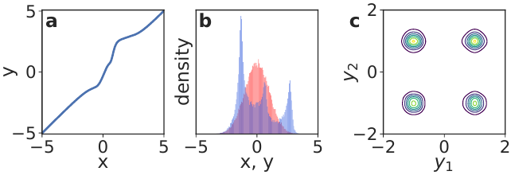
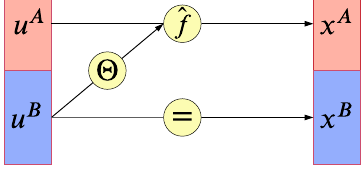
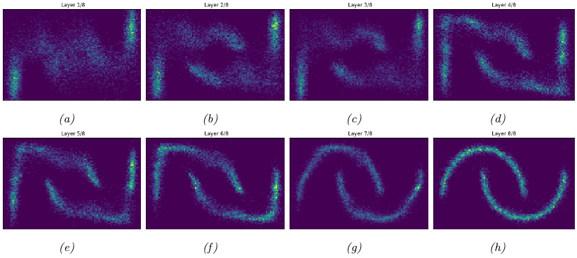
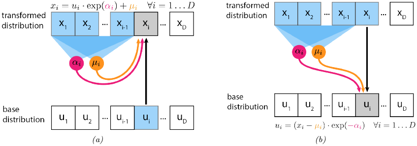
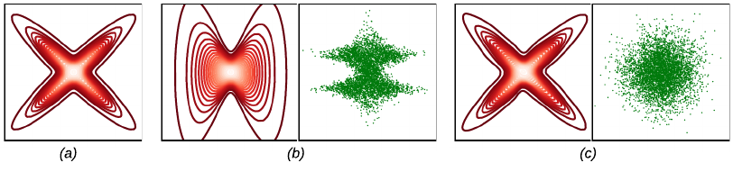
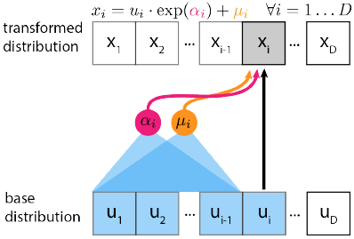

# 23.2 构造流

> 出处：Kevin Murphy《Probabilistic Machine Learning: Advanced Topics》（MIT Press, 2023），§23.2 Constructing flows，原书页码约 832–846。忠实翻译（信达雅）。

本节讨论如何构造各类流（flow），这些流在设计上即满足可逆性，并且其雅可比行列式（Jacobian determinant）可被高效计算。

### 23.2.1 仿射流

一个简单的选择是采用仿射变换（affine transformation）$x = f(u) = Au + b$。当且仅当 $A$ 为可逆方阵时，该变换才是双射（bijection）。$f$ 的雅可比行列式为 $\det A$，其逆为 $u = f^{-1}(x) = A^{-1}(x - b)$。由仿射双射构成的流称为仿射流（affine flow）；若忽略 $b$，则称为线性流（linear flow）。

仿射流本身的表达能力有限。例如，假设基分布（base distribution）为高斯分布 $p(u) = \mathcal{N}(u|\mu, \Sigma)$，那么经过一次仿射双射后所得的前推分布（pushforward distribution）仍为高斯分布 $p(x) = \mathcal{N}(x|A\mu + b, A\Sigma A^T)$。不过，当仿射双射与下文将讨论的非仿射双射复合使用时，它们是有用的构件，因为它们能促使各维度在流中相互"混合"（mixing）。

出于实践方面的考虑，我们需要确保流的雅可比行列式与逆都能被快速计算。一般而言，显式计算 $\det A$ 与 $A^{-1}$ 需要 $O(D^3)$ 时间。为降低这一开销，我们可以给 $A$ 施加结构。若 $A$ 为对角矩阵，开销降为 $O(D)$。若 $A$ 为三角矩阵，则雅可比行列式等于对角元之积，因而只需 $O(D)$ 时间；对该流求逆则需要求解三角方程组 $Au = x - b$，这可以通过回代（backsubstitution）在 $O(D^2)$ 时间内完成。

三角变换的结果依赖于各维度的排序。为降低对这一排序的敏感性，并促进各维度的"混合"，我们可以将 $A$ 与一个置换矩阵（permutation matrix）相乘，置换矩阵的行列式绝对值为 1。我们常采用一种在每一层反转各下标顺序、或随机打乱各下标的置换。不过，通常每一层的置换是固定的，而非通过学习得到。

对于具有空间结构的数据（例如图像），我们可以将 $A$ 定义为卷积矩阵。例如，GLOW [[KD18b](../reference.md#KD18b)] 使用 $1 \times 1$ 卷积；这等价于在特征维度上做逐点线性变换，而在空间维度上做常规卷积。文献 [[HBW19](../reference.md#HBW19)] 给出了两种更一般的方法来建模 $d \times d$ 卷积：一种基于堆叠自回归卷积，另一种则在傅里叶域（Fourier domain）中执行卷积。

### 23.2.2 逐元素流

设 $h : \mathbb{R} \to \mathbb{R}$ 为标量值双射。我们可以通过逐元素地应用 $h$ 来构造一个向量值双射 $f : \mathbb{R}^D \to \mathbb{R}^D$，即 $f(u) = (h(u_1), \dots, h(u_D))$。函数 $f$ 是可逆的，其雅可比行列式由 $\prod_{i=1}^{D} \frac{dh}{du_i}$ 给出。由这类双射复合而成的流称为逐元素流（elementwise flow）。

**图 23.1**：非线性平方流（NLSq）。左图：由 4 个 NLSq 层构成的可逆映射。中图：红色为基分布（高斯分布），蓝色为左侧映射所诱导的分布。右图：一个使用 NLSq 变换与高斯基密度的 5 层自回归流的密度，该流在一个由 4 个高斯成分构成的混合分布上训练得到。取自 [[ZR19b](../reference.md#ZR19b)] 的图 5。蒙 Zachary Ziegler 惠允使用。

逐元素流本身的能力有限，因为它不对各元素之间的依赖关系建模。然而，正如下文将看到的，它们是构造更复杂流的有用构件，例如耦合流（coupling flow，见 23.2.3 节）和自回归流（autoregressive flow，见 23.2.4 节）。本节讨论用于逐元素流的标量值双射 $h : \mathbb{R} \to \mathbb{R}$ 的构造技术。

#### 23.2.2.1 仿射标量双射

仿射标量双射（affine scalar bijection）具有 $h(u; \theta) = au + b$ 的形式，其中 $\theta = (a, b) \in \mathbb{R}^2$。（这是仿射流的标量版本。）其导数 $\frac{dh}{du}$ 等于 $a$。当且仅当 $a \neq 0$ 时它可逆。在实践中，我们常将 $a$ 参数化为正值，例如令其为某个无约束参数的指数或 softplus 函数。当 $a = 1$ 时，$h(u; \theta) = u + b$，这通常称为加性标量双射（additive scalar bijection）。

#### 23.2.2.2 高阶扰动

仿射标量双射使用简便，但能力有限。我们可以在保持可逆性的约束下，通过添加高阶扰动使其更具灵活性。例如，Ziegler 与 Rush [[ZR19b](../reference.md#ZR19b)] 提出了如下变换，他们称之为非线性平方流（non-linear squared flow）：

$$h(u; \theta) = au + b + \frac{c}{1 + (du + e)^2}, \tag{23.9}$$

其中 $\theta = (a, b, c, d, e) \in \mathbb{R}^5$。当 $c = 0$ 时，它退化为仿射情形。当 $c \neq 0$ 时，它添加了一个反二次（inverse-quadratic）扰动，该扰动可诱导出多峰性（multimodality），如图 23.1 所示。在 $a > \frac{9}{8\sqrt{3}}cd$ 与 $d > 0$ 的约束下，该函数变为可逆，且其逆可通过求解一个二次多项式解析地计算出来。

#### 23.2.2.3 严格单调标量函数的组合

严格单调标量函数是指处处递增（导数处处为正）或处处递减（导数处处为负）的函数。这类函数是可逆的。许多激活函数都是严格单调的，例如 logistic sigmoid 函数 $\sigma(u) = 1/(1 + \exp(-u))$。以这类激活函数为出发点，我们可以通过锥组合（conical combination，即系数为正的线性组合）与函数复合来构造更灵活的单调函数。假设 $h_1, \dots, h_K$ 严格递增，那么下列函数也严格递增：

- $a_1 h_1 + \cdots + a_K h_K + b$，其中 $a_k > 0$（带偏置的锥组合）；
- $h_1 \circ \cdots \circ h_K$（函数复合）。

通过反复施用上述两种构造，我们可以构建任意复杂的递增函数。例如，logistic sigmoid 的锥组合的复合，就是一个所有权重均为正的多层感知机（MLP）[[Hua+18b](../reference.md#Hua+18b)]。

这类标量双射的导数可通过反复施用链式法则来计算，在实践中可借助自动微分（automatic differentiation）完成。然而，其逆通常没有闭式解。在实践中，由于函数是单调的，我们可以使用二分搜索（bisection search）来计算其逆。

#### 23.2.2.4 由积分构造标量双射

确保标量函数严格单调的一种简单办法，是约束其导数为正。令 $h' = \frac{dh}{du}$ 为该导数。Wehenkel 与 Louppe [[WL19](../reference.md#WL19)] 直接用一个神经网络来参数化 $h'$，并通过一个上移 1 个单位的 ELU 激活函数使其输出为正。随后他们对该导数做数值积分以得到双射：

$$h(u) = \int_0^u h'(t)\,dt + b, \tag{23.10}$$

其中 $b$ 为偏置。他们将这一方法称为无约束单调神经网络（unconstrained monotonic neural networks）。

上述积分一般没有闭式解。然而，若对 $h'$ 施加适当的约束，积分便可解析求得。例如，Jaini、Selby 与 Yu [[JSY19](../reference.md#JSY19)] 将 $h'$ 取为 $K$ 个 $L$ 次平方多项式之和：

$$h'(u) = \sum_{k=1}^{K} \left( \sum_{\ell=0}^{L} a_{k\ell} u^{\ell} \right)^2. \tag{23.11}$$

这使得 $h'$ 成为一个次数为 $2L$ 的非负多项式。该积分在解析上可解，并使 $h$ 成为一个次数为 $2L + 1$ 的递增多项式。当 $L = 0$ 时，$h'$ 为常数，于是 $h$ 退化为仿射标量双射。

在这些方法中，双射的导数可直接读出。然而，其逆一般无法解析求得。在实践中，我们可以使用二分搜索来数值地计算其逆。

#### 23.2.2.5 样条

构造单调标量函数的另一种方法是使用样条（spline）。样条是分段多项式或分段有理函数，以样条所经过的 $K + 1$ 个节点（knot）$(u_k, x_k)$ 来参数化。也就是说，我们令 $h(u_k) = x_k$，并通过用多项式或有理函数（两个多项式之比）将 $x_{k-1}$ 插值到 $x_k$，来在区间 $(u_{k-1}, u_k)$ 上定义 $h$。通过增加节点数量，我们可以构造出任意灵活的单调函数。

**图 23.2**：耦合层 $x = f(u)$ 的图示。一个参数由 $u_B$ 确定的双射被作用于 $u_A$ 以生成 $x_A$；与此同时 $x_B = u_B$ 原样传递，因此该映射可被求逆。取自 [[KPB19](../reference.md#KPB19)] 的图 3。蒙 Ivan Kobyzev 惠允使用。

在节点之间进行插值的不同方式，给出不同类型的样条。一个简单的选择是线性插值 [Mül+19a]。然而，这会使导数在节点处不连续。用二次多项式插值 [Mül+19a] 则提供了足够的灵活性，可使导数连续。用三次多项式 [[Dur+19](../reference.md#Dur+19)]、线性多项式之比 [[DEL20](../reference.md#DEL20)] 或二次多项式之比 [[DBP19](../reference.md#DBP19)] 进行插值，则允许节点处的导数取任意的参数值。

若取 $u_{k-1} < u_k$、$x_{k-1} < x_k$，并确保节点之间的插值本身递增，则该样条严格递增。视插值函数的灵活程度而定，可能存在不止一种插值；在实践中，我们选取一种能保证始终递增的插值（细节参见上文所引文献）。

样条的一个优点是：若插值函数仅含低次多项式，则其逆可解析地求得。在此情形下，我们按如下方式计算 $u = h^{-1}(x)$：首先，用二分搜索定位 $x$ 所在的区间 $(x_{k-1}, x_k)$；然后，解析地求解由此得到的低次多项式以得出 $u$。

### 23.2.3 耦合流

本节介绍**耦合流（coupling flows）**，它使我们能够利用任意非线性函数（例如深度神经网络）来刻画各维度之间的依赖关系。考虑将输入 $u \in \mathbb{R}^D$ 划分为两个子空间 $(u^A, u^B) \in \mathbb{R}^d \times \mathbb{R}^{D-d}$，其中 $d$ 是介于 $1$ 与 $D-1$ 之间的整数。假设存在一个由 $\theta$ 参数化、作用于子空间 $\mathbb{R}^d$ 上的双射 $\hat{f}(\cdot; \theta) : \mathbb{R}^d \to \mathbb{R}^d$。我们定义函数 $f : \mathbb{R}^D \to \mathbb{R}^D$，使得 $x = f(u)$ 如下给出：

$$x^A = \hat{f}(u^A; \Theta(u^B)) \tag{23.12}$$

$$x^B = u^B. \tag{23.13}$$

图示见图 23.2。函数 $f$ 称为**耦合层（coupling layer）** [[DKB15](../reference.md#DKB15); [DSDB17](../reference.md#DSDB17)]，因为它通过 $\hat{f}$ 与 $\Theta$ 把 $u^A$ 和 $u^B$ “耦合”在了一起。我们把由耦合层构成的流称为耦合流。

$\hat{f}$ 的参数由 $\theta = \Theta(u^B)$ 计算得到，其中 $\Theta$ 是一个任意函数，称为**调节器（conditioner）**。仿射流以线性方式混合各维度，逐元素流则完全不混合各维度，而耦合流与二者不同：它能够借助一个灵活的非线性调节器 $\Theta$ 来混合各维度。在实践中，我们常把 $\Theta$ 实现为一个深度神经网络；任何架构均可使用，包括 MLP、CNN、ResNet 等。

耦合层 $f$ 是可逆的，其逆 $u = f^{-1}(x)$ 由下式给出：

$$u^A = \hat{f}^{-1}(x^A; \Theta(x^B)) \tag{23.14}$$

$$u^B = x^B. \tag{23.15}$$

也就是说，$f^{-1}$ 只需把 $\hat{f}$ 替换为 $\hat{f}^{-1}$ 即可得到。由于 $x^B$ 不依赖于 $u^A$，$f$ 的雅可比矩阵呈分块三角形：

$$J(f) = \begin{pmatrix} \partial x^A/\partial u^A & \partial x^A/\partial u^B \\ \partial x^B/\partial u^A & \partial x^B/\partial u^B \end{pmatrix} = \begin{pmatrix} J(\hat{f}) & \partial x^A/\partial u^B \\ 0 & I \end{pmatrix}. \tag{23.16}$$

因此，$\det J(f)$ 等于 $\det J(\hat{f})$。

我们通常把 $\hat{f}$ 定义为一个逐元素双射，从而使 $\hat{f}^{-1}$ 与 $\det J(\hat{f})$ 都易于计算。也就是说，我们定义：

$$\hat{f}(u^A; \theta) = \big(h(u^A_1; \theta_1), \dots, h(u^A_d; \theta_d)\big), \tag{23.17}$$

其中 $h(\cdot; \theta_i)$ 是一个由 $\theta_i$ 参数化的标量双射。第 23.2.2 节所述的任何标量双射都可用于此处。例如，$h(\cdot; \theta_i)$ 可以是一个仿射双射，$\theta_i$ 为其缩放与平移参数（第 23.2.2.1 节）；也可以是一个单调 MLP，$\theta_i$ 为其权重与偏置（第 23.2.2.3 节）；还可以是一个单调样条，$\theta_i$ 为其节点坐标（第 23.2.2.5 节）。

将 $u$ 划分为 $(u^A, u^B)$ 的方式有很多。一种简单的方式就是把 $u$ 平分为两半。我们也可以在划分时利用空间结构。例如，若 $u$ 是一幅图像，我们可以用“棋盘格”模式来划分其像素，即把“黑格”中的像素归入 $u^A$，把“白格”中的像素归入 $u^B$ [[DSDB17](../reference.md#DSDB17)]。由于每个耦合层只对输入的一部分进行变换，在实践中我们通常沿耦合流采用不同的划分方式，以确保所有变量都得到变换，并都有机会彼此交互。

最后，若 $\hat{f}$ 是逐元素双射，我们可以借助一个二值掩码 $b$ 轻松实现任意划分，如下所示：

$$x = b \odot u + (1 - b) \odot \hat{f}(u; \Theta(b \odot u)), \tag{23.18}$$

其中 $\odot$ 表示逐元素相乘。$b$ 中取值为 $0$ 表示 $u$ 中对应元素被变换（属于 $u^A$）；取值为 $1$ 表示该元素保持不变（属于 $u^B$）。

作为一个例子，我们把一个由分段有理二次样条构成的掩码耦合流拟合到双月（two moons）数据集上。该拟合模型每一层产生的样本如图 23.3 所示。

### 23.2.4 自回归流

本节讨论**自回归流（autoregressive flows）**，即由自回归双射复合而成的流。与耦合流一样，自回归流使我们能够用任意非线性函数（例如深度神经网络）来刻画各变量之间的依赖关系。

**图 23.3**：(a) 双月数据集。(b) 拟合到该数据集的归一化流所产生的样本。由 two_moons_nsf_normalizing_flow.ipynb 生成。

设输入 $u$ 包含 $D$ 个标量元素，即 $u = (u_1, \dots, u_D) \in \mathbb{R}^D$。我们定义一个**自回归双射（autoregressive bijection）** $f : \mathbb{R}^D \to \mathbb{R}^D$，其输出记为 $x = (x_1, \dots, x_D) \in \mathbb{R}^D$，如下所示：

$$x_i = h(u_i; \Theta_i(x_{1:i-1})), \quad i = 1, \dots, D. \tag{23.19}$$

每个输出 $x_i$ 都依赖于对应的输入 $u_i$ 以及所有此前的输出 $x_{1:i-1} = (x_1, \dots, x_{i-1})$。函数 $h(\cdot; \theta) : \mathbb{R} \to \mathbb{R}$ 是一个标量双射（例如第 23.2.2 节所述的某一种），由 $\theta$ 参数化。函数 $\Theta_i$ 是一个调节器，它在给定所有此前输出 $x_{1:i-1}$ 的条件下，输出用以生成 $x_i$ 的参数 $\theta_i$。与耦合流中一样，$\Theta_i$ 可以是任意非线性函数，且常被参数化为一个深度神经网络。

由于 $h$ 可逆，$f$ 也可逆，其逆由下式给出：

$$u_i = h^{-1}(x_i; \Theta_i(x_{1:i-1})), \quad i = 1, \dots, D. \tag{23.20}$$

$f$ 的一个重要性质是：每个输出 $x_i$ 依赖于 $u_{1:i} = (u_1, \dots, u_i)$，而不依赖于 $u_{i+1:D} = (u_{i+1}, \dots, u_D)$；因此，只要 $j > i$，偏导数 $\partial x_i / \partial u_j$ 就恒等于零。所以，雅可比矩阵 $J(f)$ 是三角形的，其行列式正好是其对角元素之积：

$$\det J(f) = \prod_{i=1}^{D} \frac{\partial x_i}{\partial u_i} = \prod_{i=1}^{D} \frac{dh}{du_i}. \tag{23.21}$$

换言之，$f$ 的自回归结构使其雅可比行列式可在 $O(D)$ 时间内高效计算。

自回归双射虽然可逆，但在计算上是不对称的：求值 $f$ 本质上是串行的，而求值 $f^{-1}$ 本质上是并行的。这是因为我们需要 $x_{1:i-1}$ 才能计算 $x_i$；因此，$x$ 的各分量必须串行计算，即先算 $x_1$，再用它算 $x_2$，再用 $x_1$ 和 $x_2$ 算 $x_3$，依此类推。另一方面，逆向计算可以对每个 $u_i$ 并行进行，因为 $u$ 并不出现在式 (23.20) 的右端。因此，在实践中（假设 $h$ 与 $h^{-1}$ 的计算开销相近），计算 $f^{-1}$ 往往比计算 $f$ 更快。

**图 23.4**：(a) 含一层的仿射自回归流。在本图中，$u$ 是流的输入（来自基分布的样本），$x$ 是其输出（来自变换后分布的样本）。(b) 上述流的逆。取自 [[Jan18](../reference.md#Jan18)]，蒙 Eric Jang 慷慨授权使用。

#### 23.2.4.1 仿射自回归流

作为一个具体例子，我们可以取 $h$ 为一个仿射标量双射（第 23.2.2.1 节），由对数缩放 $\alpha$ 与偏置 $\mu$ 参数化。这样的自回归流称为**仿射自回归流（affine autoregressive flows）**。第 $i$ 个分量的参数 $\alpha_i$ 与 $\mu_i$ 是 $x_{1:i-1}$ 的函数，因此 $f$ 取如下形式：

$$x_i = u_i \exp(\alpha_i(x_{1:i-1})) + \mu_i(x_{1:i-1}). \tag{23.22}$$

图 23.4(a) 对此作了图示。我们可以将其求逆为

$$u_i = (x_i - \mu_i(x_{1:i-1})) \exp(-\alpha_i(x_{1:i-1})). \tag{23.23}$$

图 23.4(b) 对此作了图示。最后，我们可以按下式计算雅可比行列式的对数绝对值：

$$\log |\det J(f)| = \log \prod_{i=1}^{D} \exp(\alpha_i(x_{1:i-1})) = \sum_{i=1}^{D} \alpha_i(x_{1:i-1}). \tag{23.24}$$

让我们来看一个仿射自回归流应用于二维密度估计问题的例子。考虑一个仿射自回归流 $x = (x_1, x_2) = f(u)$，其中 $u \sim \mathcal{N}(0, I)$，$f$ 是单个自回归双射。由于 $x_1$ 是 $u_1 \sim \mathcal{N}(0, 1)$ 的仿射变换，因此它服从均值为 $\mu_1$、标准差为 $\sigma_1 = \exp \alpha_1$ 的高斯分布。类似地，若把 $x_1$ 视为固定，则 $x_2$ 是 $u_2 \sim \mathcal{N}(0, 1)$ 的仿射变换，因此它条件地服从均值为 $\mu_2(x_1)$、标准差为 $\sigma_2(x_1) = \exp \alpha_2(x_1)$ 的高斯分布。因此，单个仿射自回归双射总会产生一个具有高斯条件分布的分布，即形如下式的分布：

$$p(x_1, x_2) = p(x_1)\, p(x_2 | x_1) = \mathcal{N}(x_1 | \mu_1, \sigma_1^2)\, \mathcal{N}(x_2 | \mu_2(x_1), \sigma_2(x_1)^2) \tag{23.25}$$

这一结论可推广到任意维数 $D$。

**图 23.5**：使用高斯基分布的仿射自回归流密度估计。(a) 真实密度。(b) 使用单个自回归层（变量次序为 $(x_1, x_2)$）的估计密度。左图（等高线图）展示 $p(x)$。右图（绿点）展示 $u = f^{-1}(x)$ 的样本，其中 $x$ 取自真实密度。(c) 与 (b) 相同，但使用 5 个自回归层，并在每一层之后反转变量次序。改编自 [[PPM17](../reference.md#PPM17)] 的图 1，蒙 Iain Murray 慷慨授权使用。

无论函数 $\alpha_2(x_1)$ 与 $\mu_2(x_1)$ 多么灵活，单个仿射双射的表达能力都不强。例如，假设我们想用这样的流去拟合图 23.5(a) 所示的十字形密度。所得的极大似然拟合结果如图 23.5(b) 所示。红色等高线展示的是预测分布 $\hat{p}(x)$，可见它明显未能捕捉到真实分布。绿点展示的是数据样本经变换后的版本 $p(u)$；我们看到，它与高斯基分布相去甚远。

所幸，我们可以通过复合多个自回归双射（即多层），并在每一层之后反转变量次序，来获得更好的拟合。例如，图 23.5(c) 展示了一个含 5 层的仿射自回归流应用于同一问题的结果。红色等高线表明我们已匹配了经验分布，绿点则表明我们已匹配了高斯基分布。

请注意，获得更好拟合的另一种方式，是把仿射双射 $h$ 替换为一个更灵活的双射，例如单调 MLP（第 23.2.2.3 节）或单调样条（第 23.2.2.5 节）。

#### 23.2.4.2 掩码自回归流

正如我们所见，调节器 $\Theta_i$ 可以是任意非线性函数。对它们进行参数化最直接的方式，是对每个 $i$ 分别参数化，例如使用 $D$ 个独立的神经网络。然而，当 $D$ 很大时，这种方式在参数上是低效的。

在实践中，我们常在各调节器之间共享参数，即把它们合并为单一模型 $\Theta$，该模型接收 $x$ 并输出 $(\theta_1, \dots, \theta_D)$。为使该双射保持自回归性，我们必须约束 $\Theta$，使 $\theta_i$ 只依赖于 $x_{1:i-1}$ 而不依赖于 $x_{i:D}$。实现这一点的一种方式是：从一个任意的神经网络（MLP、CNN、ResNet 等）出发，去掉某些连接（例如将权重置零），直到 $\theta_i$ 仅是 $x_{1:i-1}$ 的函数为止。

**图 23.6**：使用仿射标量双射的逆自回归流。在本图中，$u$ 是流的输入（来自基分布的样本），$x$ 是其输出（来自变换后分布的样本）。取自 [[Jan18](../reference.md#Jan18)]，蒙 Eric Jang 慷慨授权使用。

这种方法的一个例子是 [[PPM17](../reference.md#PPM17)] 提出的**掩码自回归流（masked autoregressive flow, MAF）**模型。该模型是一个仿射自回归流与置换层的结合，正如我们在第 23.2.4.1 节所述。MAF 按如下方式实现合并后的调节器 $\Theta$：它从一个 MLP 出发，然后将每一层的权重矩阵与一个同尺寸的二值掩码逐元素相乘（不同层使用不同的掩码）。这些掩码是用 [[Ger+15](../reference.md#Ger+15)] 的方法构造的。这确保了只要 $j \geq i$，从 $x_j$ 到 $\theta_i$ 的所有计算路径都被置零，从而有效地使 $\theta_i$ 仅为 $x_{1:i-1}$ 的函数。即便如此，求值这个掩码后的调节器 $\Theta$ 与求值原始（未掩码的）MLP 具有相同的计算开销。

MAF（及相关模型）的关键优势在于：给定 $x$，所有参数 $(\theta_1, \dots, \theta_D)$ 都能通过一次神经网络求值高效算出，因此逆 $f^{-1}$ 的计算很快。这样，我们就能对任意数据点高效地求出该流模型的概率密度。然而，为了计算 $f$，调节器 $\Theta$ 必须总共被调用 $D$ 次，因为一开始并非 $x$ 的所有分量都可用。因此，从该流生成新样本要比求值其概率密度函数昂贵 $D$ 倍。这使得 MAF 适合于密度估计，却不太适合于数据生成。

#### 23.2.4.3 逆自回归流

正如我们所见，用以生成第 $i$ 个输出 $x_i$ 的参数 $\theta_i$ 是此前各输出 $x_{1:i-1}$ 的函数。这确保了雅可比矩阵 $J(f)$ 是三角形的，因而其行列式计算高效。

然而，还存在另一种可能：我们可以让 $\theta_i$ 转而成为此前各输入的函数，即 $u_{1:i-1}$ 的函数。这便引出如下双射，称为**逆自回归（inverse autoregressive）**：

$$x_i = h(u_i; \Theta_i(u_{1:i-1})), \quad i = 1, \dots, D. \tag{23.26}$$

与其自回归对应物一样，该双射也具有三角形雅可比矩阵，其行列式同样由 $\det J(f) = \prod_{i=1}^{D} \frac{dh}{du_i}$ 给出。图 23.6 图示了一个逆自回归流，对应 $h$ 为仿射的情形。

为理解这个双射为何称为“逆自回归”，可将式 (23.26) 与式 (23.20) 作比较。这两个公式仅在记号上有所不同：把 $u$ 与 $x$ 互换、把 $h$ 与 $h^{-1}$ 互换，即可从一个得到另一个。换言之，逆自回归双射对应于对一个自回归双射之逆的直接参数化。

由于逆自回归双射把其自回归对应物的正向与逆向方向互换了，它们也把二者的计算性质互换了。这意味着，逆自回归流的正向方向 $f$ 本质上是并行的，因而很快；而其逆向方向 $f^{-1}$ 本质上是串行的，因而很慢。

逆自回归流的一个例子，是与其同名的、由 [[Kin+16](../reference.md#Kin+16)] 提出的 IAF 模型。IAF 使用仿射标量双射、掩码调节器和置换层，因此它恰好是第 23.2.4.2 节所述 MAF 模型的逆。使用 IAF，我们可以从基分布（例如使用一个对角高斯分布）并行地生成 $u$，然后并行地采样 $x$ 的每个元素。然而，对任意数据点 $x$ 求值 $p(x)$ 很慢，因为我们必须串行地求值 $u$ 的每个元素。所幸，对由 IAF 生成的样本（而非外部提供的样本）求值其似然不会带来额外开销，因为在这种情形下各 $u_i$ 项早已被计算出来。

IAF 虽然不太适合密度估计或极大似然训练，却很适合在变分推断中对变分后验进行参数化。这是因为，为估计变分下界（ELBO），我们只需要来自变分后验的样本及其对应的概率密度，而二者都能高效获得。详情参见第 23.1.2.2 节。

IAF 的另一项有用应用，是训练它们去模仿那些概率密度求值快、但采样慢的模型。一个著名的例子是 [[Oor+18](../reference.md#Oor+18)] 提出的**并行 WaveNet（parallel wavenet）**模型。该模型是一个 IAF，记为 $p_s$，它通过最小化 KL 散度 $D_{KL}(p_s \,\|\, p_t)$ 来训练以模仿一个预训练好的 WaveNet 模型 $p_t$。这一 KL 散度很容易估计：先从 $p_s$ 采样，再在这些样本处求值 $\log p_s$ 与 $\log p_t$，而这些运算对这两个模型而言都是高效的。训练之后，我们便得到一个 IAF，它能生成与原始 WaveNet 质量相当的音频，但速度要快得多。

#### 23.2.4.4 与自回归模型的关系

自回归流可以被看作是对第 22.1 节讨论过的连续随机变量自回归模型的推广。具体而言，任何连续自回归模型都可以被重新参数化为一个单层自回归流，下面我们将对此加以说明。

考虑一个针对连续随机变量 $x = (x_1, \dots, x_D) \in \mathbb{R}^D$ 的一般自回归模型，写作

$$p(x) = \prod_{i=1}^{D} p_i(x_i | \theta_i) \quad \text{其中} \quad \theta_i = \Theta_i(x_{1:i-1}). \tag{23.27}$$

在上式中，$p_i(x_i | \theta_i)$ 是该自回归模型的第 $i$ 个条件分布，其参数 $\theta_i$ 是此前各变量 $x_{1:i-1}$ 的任意函数。例如，$p_i(x_i | \theta_i)$ 可以是一维高斯分布的混合，$\theta_i$ 表示其各均值、方差与混合系数的集合。

现在考虑从该自回归模型采样一个向量 $x$，这可以通过逐个元素采样来完成，如下所示：

$$x_i \sim p_i(x_i | \Theta_i(x_{1:i-1})) \quad \text{对} \quad i = 1, \dots, D. \tag{23.28}$$

每个条件分布都可以用逆变换采样（第 11.3.1 节）来采样。设 $U(0, 1)$ 为区间 $[0, 1]$ 上的均匀分布，并设 $\mathrm{CDF}_i(x_i | \theta_i)$ 为第 $i$ 个条件分布的累积分布函数。采样可写作：

$$x_i = \mathrm{CDF}_i^{-1}(u_i | \Theta_i(x_{1:i-1})) \quad \text{其中} \quad u_i \sim U(0, 1). \tag{23.29}$$

将上式与式 (23.19) 中自回归双射的定义作比较，我们看到，该自回归模型已被表达为一个单层自回归流，其基分布是 $[0, 1]^D$ 上的均匀分布，其标量双射对应于各条件分布的逆 cdf。以这种方式把自回归模型视为流，有一个重要优势：它使我们能够通过在一个流中复合该模型的多个实例来提升自回归模型的灵活性，而不必牺牲整体的可处理性。

### 23.2.5 残差流（Residual flows）

残差网络是若干残差连接（residual connection）的复合，而残差连接是形如 $f(u) = u + F(u)$ 的函数。其中函数 $F : \mathbb{R}^D \to \mathbb{R}^D$ 称为残差块（residual block），它计算的是输出与输入之差，即 $f(u) - u$。

在对 $F$ 施加某些条件之后，残差连接 $f$ 便成为可逆的。我们把由可逆残差连接复合而成的流称为残差流（residual flow）。下面，我们介绍两种约束残差块 $F$ 的方式，使得残差连接 $f$ 可逆。

#### 23.2.5.1 收缩残差块（Contractive residual blocks）

保证残差连接可逆的一种方式，是把残差块取为一个收缩（contraction）。所谓收缩，是指其 Lipschitz 常数小于 1 的函数 $F$；也就是说，存在 $0 \le L < 1$，使得对所有 $u_1$ 和 $u_2$ 都有：

$$\|F(u_1) - F(u_2)\| \le L\|u_1 - u_2\|. \tag{23.30}$$

$f(u) = u + F(u)$ 的可逆性可如下证明。考虑映射 $g(u) = x - F(u)$。由于 $F$ 是收缩，故 $g$ 也是收缩。于是，由 Banach 不动点定理（Banach's fixed-point theorem），$g$ 有唯一不动点 $u^*$。因此我们有

$$u^* = x - F(u^*) \tag{23.31}$$

$$\Rightarrow \quad u^* + F(u^*) = x \tag{23.32}$$

$$\Rightarrow \quad f(u^*) = x. \tag{23.33}$$

由于 $u^*$ 是唯一的，由此可知 $u^* = f^{-1}(x)$。

采用收缩残差块的残差流的一个例子是 [[Beh+19](../reference.md#Beh+19)] 的 iResNet 模型。iResNet 的残差块是卷积神经网络，即卷积层与非线性激活函数的复合。由于复合的 Lipschitz 常数小于或等于各个函数 Lipschitz 常数之积，因此只需保证各卷积是收缩的，并使用斜率小于或等于 1 的递增激活函数即可。iResNet 模型通过对卷积的权重施加谱归一化（spectral normalization）来确保卷积是收缩的 [[Miy+18a](../reference.md#Miy+18a)]。

一般而言，逆映射 $f^{-1}$ 并无解析表达式。然而，我们可以用以下迭代过程来近似 $f^{-1}(x)$：

$$u_n = g(u_{n-1}) = x - F(u_{n-1}). \tag{23.34}$$

Banach 不动点定理保证，对于任意选取的 $u_0$，序列 $u_0, u_1, u_2, \dots$ 都将收敛到 $u^* = f^{-1}(x)$，并且其收敛速率为 $O(L^n)$，其中 $L$ 是 $g$ 的 Lipschitz 常数（它与 $F$ 的 Lipschitz 常数相同）。在实践中，取 $u_0 = x$ 较为方便。

此外，雅可比行列式也没有解析表达式，其精确计算的代价为 $O(D^3)$。然而，对数雅可比行列式存在一种计算高效的随机估计量。其思路是把对数雅可比行列式表示为一个幂级数。利用 $f(x) = x + F(x)$ 这一事实，我们有

$$\log|\det J(f)| = \log|\det(I + J(F))| = \sum_{k=1}^{\infty} \frac{(-1)^{k+1}}{k} \operatorname{tr}\!\left(J(F)^k\right). \tag{23.35}$$

当 $J(F)$ 的矩阵范数小于 1 时，该幂级数收敛；而在此处，正因为 $F$ 是收缩，这一点能被精确地保证。$J(F)^k$ 的迹可以借助 Jacobian-向量积，通过 Hutchinson 迹估计量（Hutchinson trace estimator）来高效地近似 [[Ski89](../reference.md#Ski89); [Hut89](../reference.md#Hut89); [Mey+21](../reference.md#Mey+21)]：

$$\operatorname{tr}\!\left(J(F)^k\right) \approx v^\top J(F)^k v, \tag{23.36}$$

其中 $v$ 是从某个零均值、单位协方差分布（例如 $\mathcal{N}(0, I)$）中抽取的样本。最后，这个无穷级数可以用一个有限级数来近似：既可以通过截断 [[Beh+19](../reference.md#Beh+19)] 实现（遗憾的是这会给出有偏的估计量），也可以采用俄罗斯轮盘赌估计量（Russian-roulette estimator）[[Che+19](../reference.md#Che+19)]（这是无偏的）。

#### 23.2.5.2 具有低秩雅可比矩阵的残差块（Residual blocks with low-rank Jacobian）

对于某个由单位矩阵经低秩扰动而得的矩阵，存在一种高效计算其行列式的方法。设 $A$ 和 $B$ 为矩阵，其中 $A$ 为 $D \times M$、$B$ 为 $M \times D$。下面这个公式称为 Weinstein-Aronszajn 恒等式（Weinstein-Aronszajn identity）[^2]，它是更一般的矩阵行列式引理（matrix determinant lemma）的一个特例：

$$\det(I_D + AB) = \det(I_M + BA). \tag{23.37}$$

我们分别用 $I_D$ 和 $I_M$ 表示 $D \times D$ 和 $M \times M$ 的单位矩阵。该公式的意义在于，它把一个代价为 $O(D^3)$ 的 $D \times D$ 行列式，转化为一个代价为 $O(M^3)$ 的 $M \times M$ 行列式。若 $M$ 小于 $D$，便可节省计算量。

在对残差块 $F : \mathbb{R}^D \to \mathbb{R}^D$ 施加一些限制之后，我们就可以应用这个公式来高效计算残差连接的行列式。其技巧在于在 $F$ 内部制造一个瓶颈（bottleneck）。我们通过定义 $F = F_2 \circ F_1$ 来实现这一点，其中 $F_1 : \mathbb{R}^D \to \mathbb{R}^M$、$F_2 : \mathbb{R}^M \to \mathbb{R}^D$ 且 $M \ll D$。由链式法则可得 $J(F) = J(F_2)J(F_1)$，其中 $J(F_2)$ 为 $D \times M$、$J(F_1)$ 为 $M \times D$。现在我们可以如下应用前述行列式公式：

$$\det J(f) = \det(I_D + J(F)) = \det(I_D + J(F_2)J(F_1)) = \det(I_M + J(F_1)J(F_2)). \tag{23.38}$$

由于最终的行列式代价为 $O(M^3)$，因此通过减小 $M$（即收窄瓶颈），我们就能让雅可比行列式的计算变得高效。

上述方法的一个例子是 [[RM15](../reference.md#RM15)] 的平面流（planar flow）。在该模型中，每个残差块都是一个带单个隐藏层、单个隐藏单元的多层感知机（MLP）。也就是说，

$$f(u) = u + v\sigma(w^\top u + b), \tag{23.39}$$

其中 $v \in \mathbb{R}^D$、$w \in \mathbb{R}^D$ 和 $b \in \mathbb{R}$ 是参数，$\sigma$ 是激活函数。该残差块是 $F_1(u) = w^\top u + b$ 与 $F_2(z) = v\sigma(z)$ 的复合，故 $M = 1$。它们的雅可比矩阵为 $J(F_1)(u) = w^\top$ 和 $J(F_2)(z) = v\sigma'(z)$。将它们代入雅可比行列式的公式，我们得到：

$$\det J(f)(u) = 1 + w^\top v\sigma'(w^\top u + b), \tag{23.40}$$

它可以在 $O(D)$ 内高效计算。其他的例子还包括 [[RM15](../reference.md#RM15)] 的圆周流（circular flow）以及 [[Ber+18](../reference.md#Ber+18)] 的 Sylvester 流（Sylvester flow）。

这一技术给出了计算带瓶颈的残差连接行列式的高效方法，但一般而言并不能保证这类函数是可逆的。这意味着可逆性必须逐例验证。例如，当 $\sigma$ 是双曲正切函数且 $w^\top v > -1$ 时，平面流是可逆的，否则就可能不可逆。

### 23.2.6 连续时间流（Continuous-time flows）

至此，我们讨论的都是由一列双射 $f_1, \dots, f_N$ 构成的流。从某个输入 $x_0 = u$ 出发，这会产生一列输出 $x_1, \dots, x_N$，其中 $x_n = f_n(x_{n-1})$。然而，我们也可以构造这样的流：其中输入以连续的方式被变换为最终的输出。也就是说，我们从 $x_0 = x(0)$ 出发，对于某个固定的 $T$，生成一个以 $t \in [0, T]$ 连续索引的序列 $x(t)$，并取 $x(T)$ 作为最终输出。把 $t$ 类比为时间，我们将这类流称为连续时间流（continuous-time flow）。

序列 $x(t)$ 被定义为如下形式的一阶常微分方程（ODE）的解：

$$\frac{dx}{dt}(t) = F(x(t), t). \tag{23.41}$$

函数 $F : \mathbb{R}^D \times [0, T] \to \mathbb{R}^D$ 是一个随时间变化的向量场，它对该 ODE 进行参数化。若把 $x(t)$ 视作一个 $D$ 维粒子的位置，那么向量 $F(x(t), t)$ 决定了该粒子在时刻 $t$ 的速度。

该流（在时间 $T$ 上）是一个函数 $f : \mathbb{R}^D \to \mathbb{R}^D$，它接收输入 $x_0$，以初始条件 $x(0) = x_0$ 求解该 ODE，并返回 $x(T)$。若该 ODE 的解对所有 $t \in [0, T]$ 都存在且唯一，则 $f$ 是一个良定义的双射。对于任意的 $F$，这些条件一般并不满足；但如果 $F(\cdot, t)$ 是 Lipschitz 连续的，且其 Lipschitz 常数不依赖于 $t$，那么这些条件就成立。也就是说，若存在一个常数 $L$，使得对所有 $x_1, x_2$ 和 $t \in [0, T]$ 都有：

$$\|F(x_1, t) - F(x_2, t)\| \le L\|x_1 - x_2\|, \tag{23.42}$$

则 $f$ 是一个良定义的双射。这一结论是 ODE 的 Picard-Lindelöf 定理（Picard-Lindelöf theorem）的推论。[^3] 在实践中，只要满足该 Lipschitz 条件，我们就可以用任意选定的模型来参数化 $F$。

通常该 ODE 无法解析求解，但我们可以通过对其离散化来近似求解。一个简单的例子是欧拉方法（Euler's method），对于某个小步长 $\epsilon > 0$，它对应于如下离散化：

$$x(t + \epsilon) = x(t) + \epsilon F(x(t), t). \tag{23.43}$$

这等价于一个以 $\epsilon F(\cdot, t)$ 为残差块的残差连接，因此该 ODE 求解器可以被视作一个具有 $O(T/\epsilon)$ 层的深度残差网络。步长越小，解越精确，但计算量也越大。此外还有若干在精度与精巧程度上各不相同的求解方法，例如更广的 Runge-Kutta 族中的那些方法，其中一些采用自适应步长。

$f$ 的逆可以通过反向求解该 ODE 来轻松计算。也就是说，为计算 $f^{-1}(x_T)$，我们以初始条件 $x(T) = x_T$ 求解该 ODE，并返回 $x(0)$。与某些其他的流（例如自回归流，它们在一个方向上的计算代价高于另一个方向）不同，连续时间流在两个方向上所需的计算量是相同的。

一般而言，$f$ 的雅可比行列式没有解析表达式。然而，我们可以把它表示为另一个独立 ODE 的解，进而对其进行数值求解。首先，我们定义 $f_t : \mathbb{R}^D \to \mathbb{R}^D$ 为时间 $t$ 上的流，即接收 $x_0$、以初始条件 $x(0) = x_0$ 求解该 ODE 并返回 $x(t)$ 的函数。显然，$f_0$ 是恒等函数，而 $f_T = f$。让我们定义 $L(t) = \log|\det J(f_t)(x_0)|$。由于 $f_0$ 是恒等函数，故 $L(0) = 0$；又由于 $f_T = f$，故 $L(T)$ 给出了我们所关注的 $f$ 的雅可比行列式。可以证明，$L$ 满足如下 ODE：

$$\frac{dL}{dt}(t) = \operatorname{tr}\!\left(J(F(\cdot, t))(x(t))\right). \tag{23.44}$$

也就是说，$L$ 在时刻 $t$ 的变化率，等于 $F(\cdot, t)$ 在 $x(t)$ 处求值所得的雅可比迹。因此，我们可以通过以初始条件 $L(0) = 0$ 求解上述 ODE 来计算 $L(T)$。而且，我们可以同时计算 $x(T)$ 和 $L(T)$，方法是把这两个 ODE 合并为一个作用在扩展空间 $(x, L)$ 上的单一 ODE。

连续时间流的一个例子是 [[Che+18c](../reference.md#Che+18c)] 的神经 ODE（neural ODE）模型，它用一个神经网络来参数化 $F$。为避免在 ODE 求解器中反向传播梯度（这可能在计算上颇为繁重），他们采用伴随灵敏度方法（adjoint sensitivity method），把关于 $x(t)$ 的梯度的时间演化表示为另一个独立的 ODE。求解该 ODE 即可得到所需的梯度，这可以被视作反向传播的连续时间类比。

另一个例子是 [[Gra+19](../reference.md#Gra+19)] 的 FFJORD 模型。它与神经 ODE 模型类似，区别在于它使用 Hutchinson 迹估计量来近似 $F(\cdot, t)$ 的雅可比迹。这种对 Hutchinson 迹估计量的使用，与收缩残差流中的用法（见 23.2.5.1 节）相类似，它以随机（但无偏）的估计为代价来加快计算。

遗憾的是，上述方法既慢且复杂。25.4.7 节的流匹配（flow matching）技术利用一种快速的非线性最小二乘表述，为训练连续时间归一化流提供了一种更简单的途径。

[^2]: 参见 https://en.wikipedia.org/wiki/Weinstein-Aronszajn_identity 。

[^3]: 参见 https://en.wikipedia.org/wiki/Picard-Lindel%C3%B6f_theorem 。
